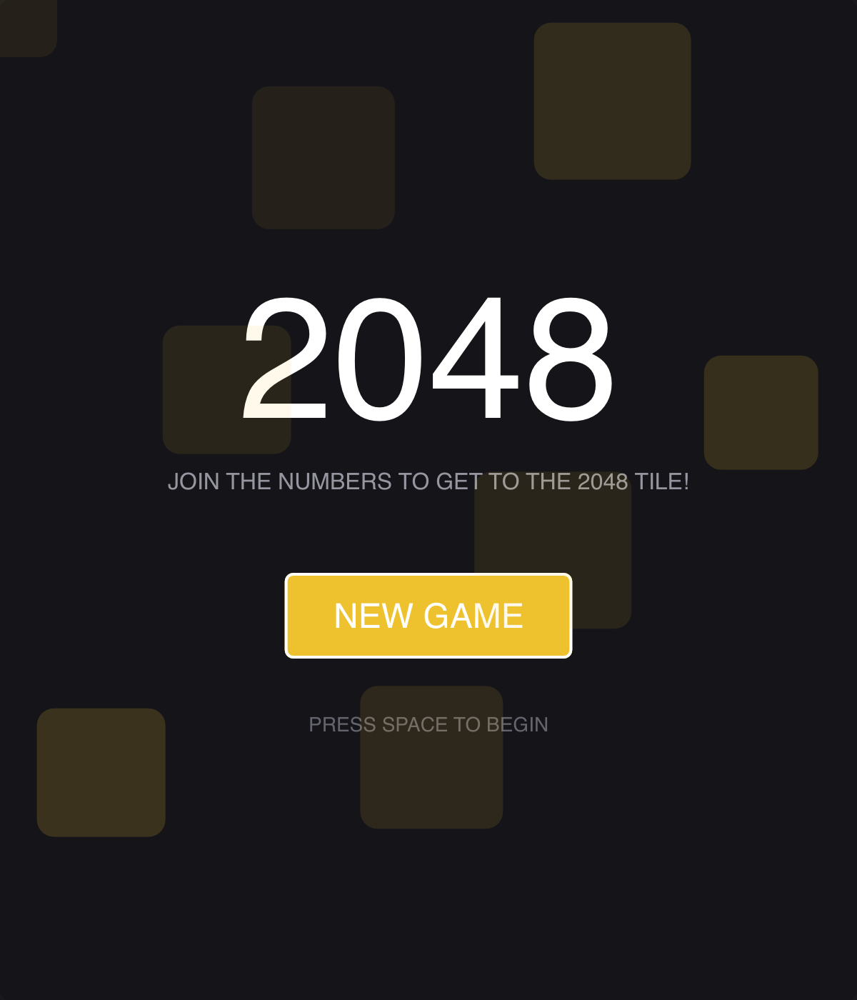

# 2048

> **Framework:** input, animation, layout **Description:** A tile-merging puzzle
> with keyboard input and animated transitions. Slide tiles to combine numbers
> and reach 2048.



<!-- explorer: tags=games,input,animation category=games run=go -->

---

## Run

```sh
go run ./examples/2048/
```

## What it demonstrates

A tile-merging puzzle with keyboard input and animated transitions. Slide tiles
to combine numbers and reach 2048.

See `main.go` for the implementation.
