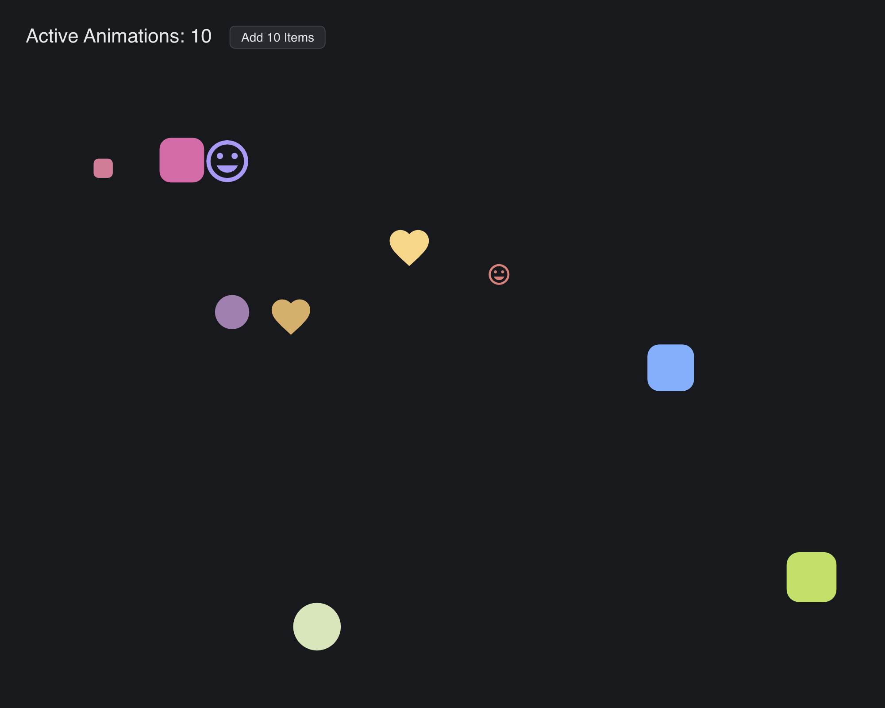

# Animation Stress

> **Framework:** animation, performance **Description:** Hundreds of concurrent
> tweens with random position, size, color, shape, and easing. Measures layout
> and render cost under animation load.



<!-- explorer: tags=animation,performance category=performance run=go -->

---

## Run

```sh
go run ./examples/animation_stress/
```

## What it demonstrates

Hundreds of concurrent tweens with random position, size, color, shape, and
easing. Measures layout and render cost under animation load.

See `main.go` for the implementation.
