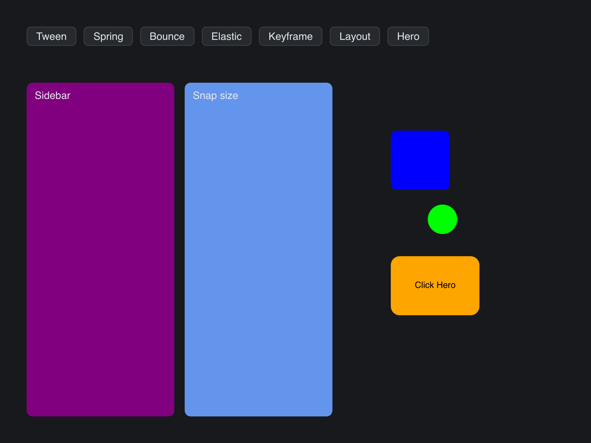

# Animations

> **Framework:** animation, layout **Description:** Tween, spring, keyframe,
> layout, and hero transitions in one window. Shows how each animation type
> interpolates state.



<!-- explorer: tags=animation,layout category=animation run=go -->

---

## Run

```sh
go run ./examples/animations/
```

## What it demonstrates

Tween, spring, keyframe, layout, and hero transitions in one window. Shows how
each animation type interpolates state.

See `main.go` for the implementation.
