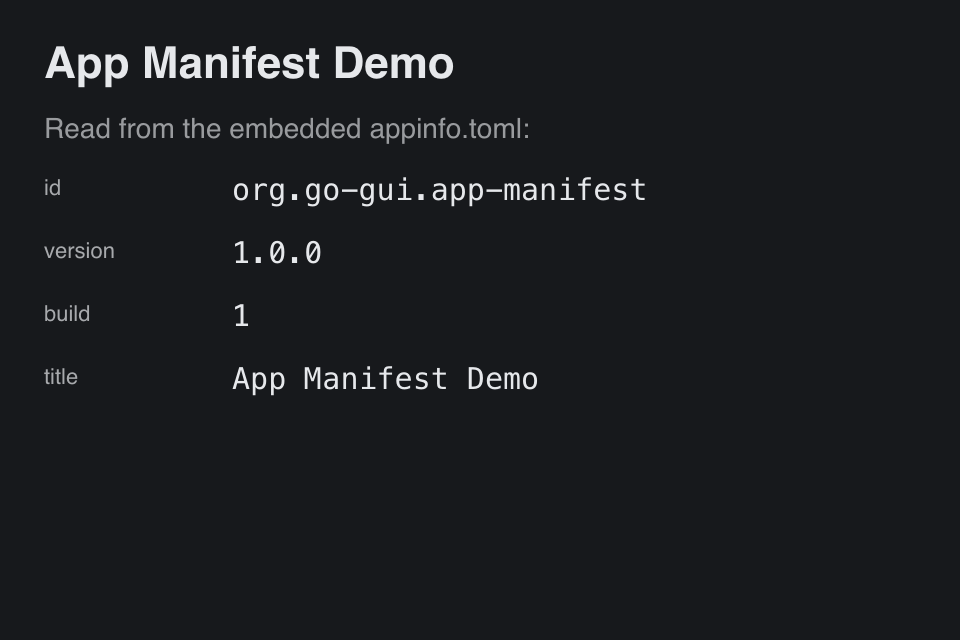

# App Manifest

> **Framework:** system, platform **Description:** One `appinfo.toml` gives the
> app its name, ID and version, for both `buildapp` and the running app.



<!-- explorer: tags=system,platform category=system run=go -->

---

## Run

```sh
go run ./examples/app_manifest/
```

## Package it

Run `buildapp` from this directory. It finds `appinfo.toml` there, so it needs
no `-name`, `-id`, `-version` or `-icon` flag:

```sh
go build -o /tmp/app_manifest ./examples/app_manifest/
cd examples/app_manifest
go run ../../cmd/buildapp -o /tmp /tmp/app_manifest
```

On macOS this writes `/tmp/App Manifest Demo.app`. Its `CFBundleIdentifier` is
`org.go-gui.app-manifest`, which is the ID the running app uses for file-access
bookmarks. Add `-platform linux` or `-platform windows` for the other packages.

## What it demonstrates

- `appinfo.toml` holds the ID, name, version, build number, icon and the
  per-platform keys.
- `main.go` embeds the file with `//go:embed` and parses it with
  `appinfo.MustParse`.
- `gui.WindowCfg.AppInfo` gives the window its title. It also gives the app its
  file-access ID, X11 `WM_CLASS` and native menubar name.
- A value set in Go wins over the manifest. A flag given to `buildapp` wins over
  the file.

See `cmd/buildapp/README.md` for the file format.
