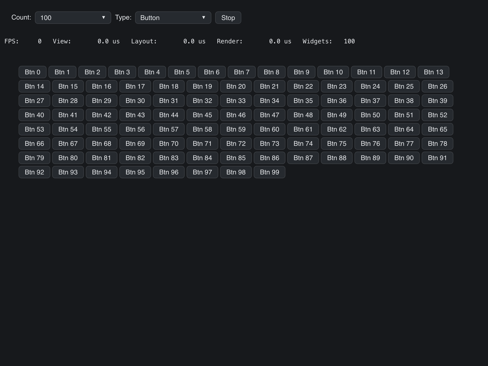

# Benchmark

> **Framework:** performance, layout **Description:** Renders large batches of
> widgets to measure frame cost. Reports timing for 500-item batches across
> mixed types.



<!-- explorer: tags=performance,layout category=performance run=go -->

---

## Run

```sh
go run ./examples/benchmark/
```

## What it demonstrates

Renders large batches of widgets to measure frame cost. Reports timing for
500-item batches across mixed types.

See `main.go` for the implementation.
