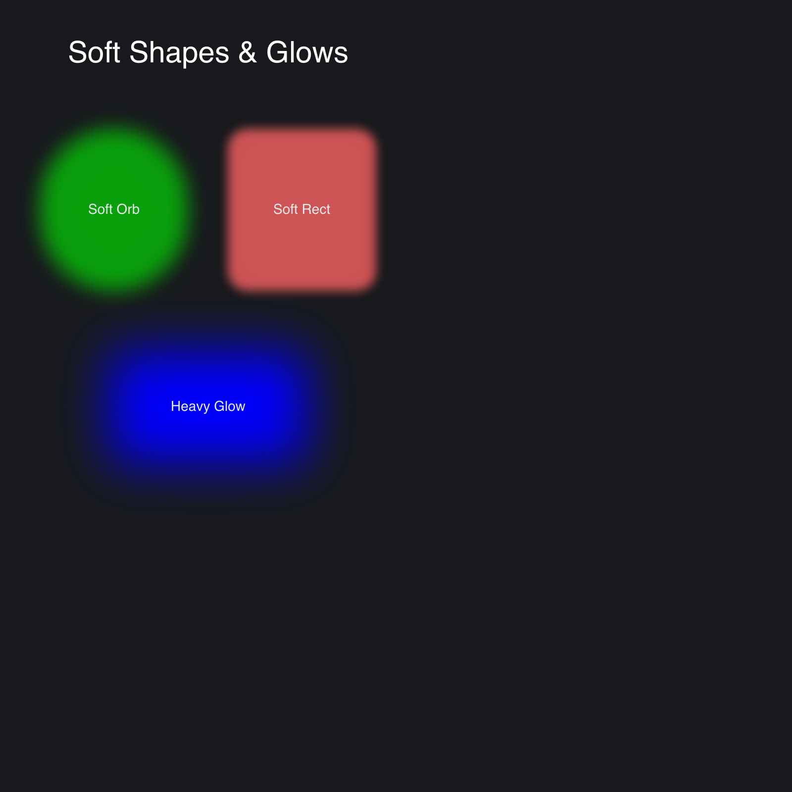

# Blur Demo

> **Framework:** graphics, theme **Description:** Applies blur radius to shapes
> to create glows and soft edges. Demonstrates blur on rectangles and overlays.



<!-- explorer: tags=graphics,theme category=graphics run=go -->

---

## Run

```sh
go run ./examples/blur_demo/
```

## What it demonstrates

Applies blur radius to shapes to create glows and soft edges. Demonstrates blur
on rectangles and overlays.

See `main.go` for the implementation.
