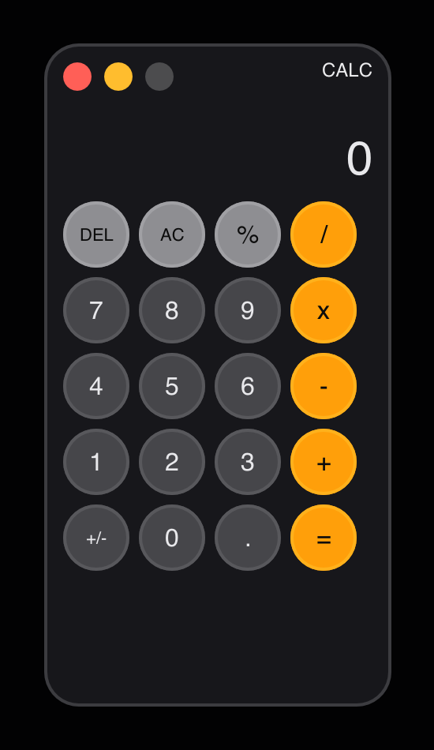

# Calculator

> **Framework:** input, layout **Description:** A working calculator with
> keyboard and mouse input. Parses expressions and updates the display from
> window state.



<!-- explorer: tags=input,layout category=input run=go -->

---

## Run

```sh
go run ./examples/calculator/
```

## What it demonstrates

A working calculator with keyboard and mouse input. Parses expressions and
updates the display from window state.

See `main.go` for the implementation.
