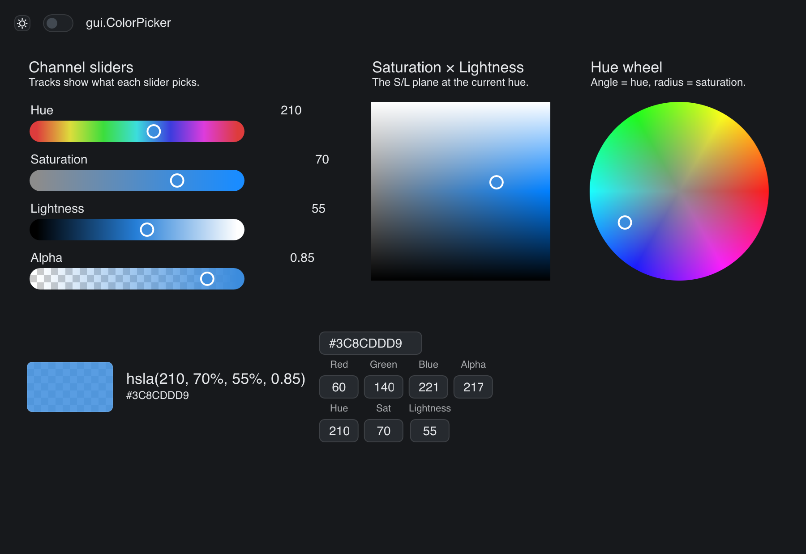

# Color Picker

> **Framework:** input, graphics **Description:** One HSLA value edited four
> ways: channel sliders, plane, wheel, and text fields. All controls stay in
> sync through shared state.



<!-- explorer: tags=input,graphics category=input run=go -->

---

## Run

```sh
go run ./examples/color_picker/
```

## What it demonstrates

One HSLA value edited four ways: channel sliders, plane, wheel, and text fields.
All controls stay in sync through shared state.

See `main.go` for the implementation.
