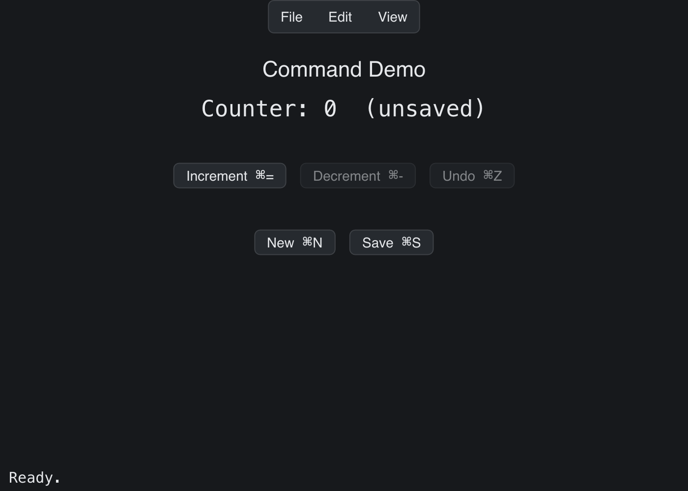

# Command Demo

> **Framework:** system **Description:** Menu bar with registered commands,
> global hotkeys, and CommandPalette integration. Shows CanExecute disabling and
> shortcut hints.



<!-- explorer: tags=system category=system run=go -->

---

## Run

```sh
go run ./examples/command_demo/
```

## What it demonstrates

Menu bar with registered commands, global hotkeys, and CommandPalette
integration. Shows CanExecute disabling and shortcut hints.

See `main.go` for the implementation.
