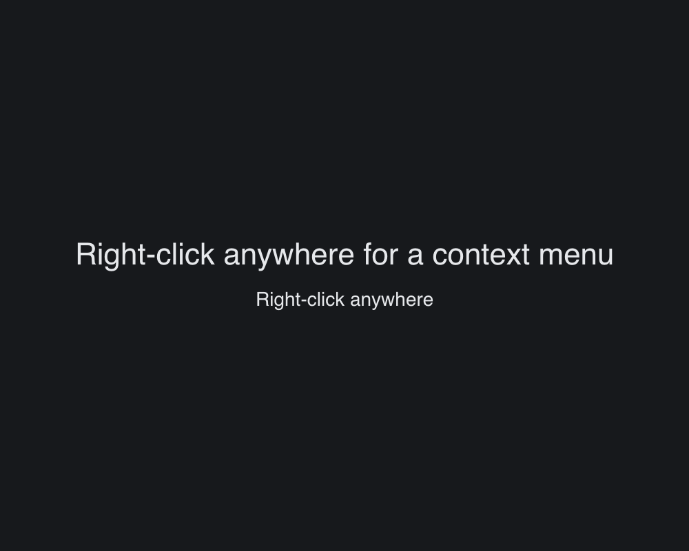

# Context Menu

> **Framework:** system, input **Description:** Right-click menus with action
> handling. Demonstrates nested menu items and selection state.



<!-- explorer: tags=system,input category=system run=go -->

---

## Run

```sh
go run ./examples/context_menu/
```

## What it demonstrates

Right-click menus with action handling. Demonstrates nested menu items and
selection state.

See `main.go` for the implementation.
