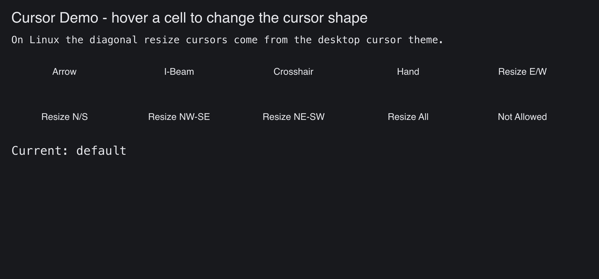

# Cursor Demo

> **Framework:** system **Description:** Every mouse cursor shape the backends
> support. Hover cells to change the cursor and see platform differences.



<!-- explorer: tags=system category=system run=go -->

---

## Run

```sh
go run ./examples/cursor_demo/
```

## What it demonstrates

Every mouse cursor shape the backends support. Hover cells to change the cursor
and see platform differences.

See `main.go` for the implementation.
