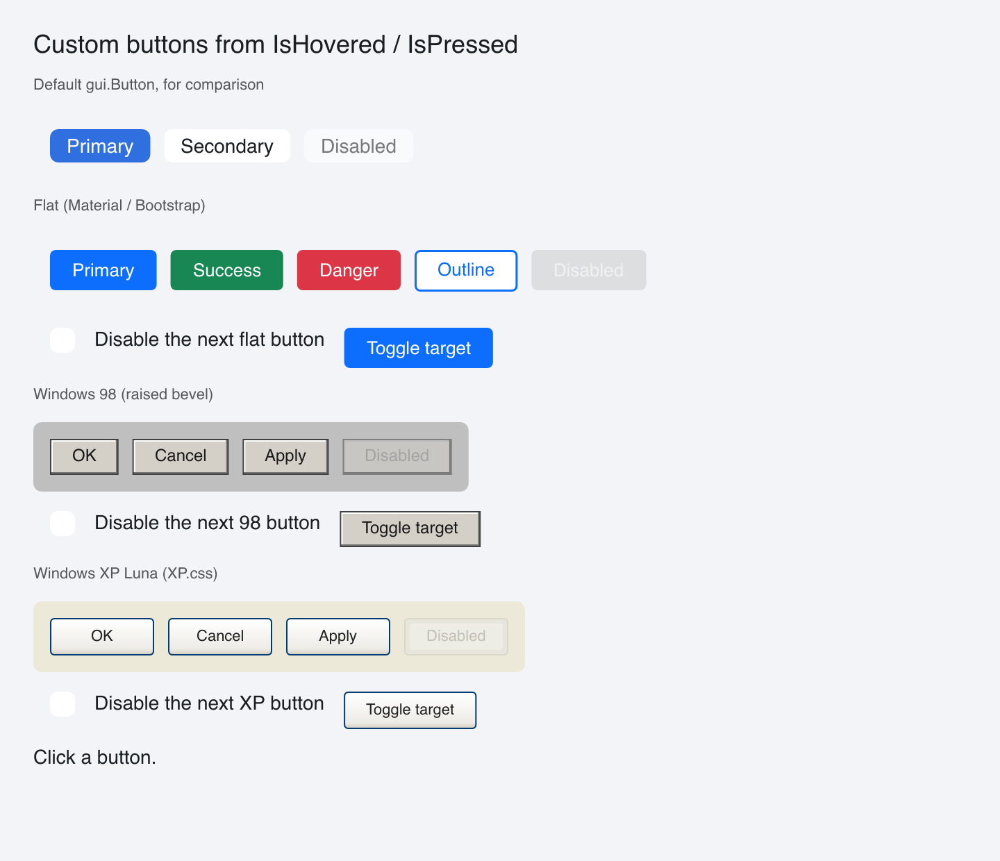

# Custom Buttons

> **Framework:** widgets **Description:** Flat, Windows 98 and Windows XP
> buttons whose look is built from hover and press state. Demonstrates
> `Window.IsHovered` and `Window.IsPressed` read while a view is built.



<!-- explorer: tags=widgets,styling category=widgets run=go -->

---

## Run

```sh
go run ./examples/custom_buttons/
```

## What it demonstrates

A port of go-shirei's custom-buttons demo. Each custom button is a `gui.View`
whose `GenerateLayout` asks the window about itself, then builds the matching
look:

```go
eid := w.EffID(b.id)
armed := w.IsPressed(eid) && w.IsHovered(eid)
```

- **Flat** filled buttons need no new API: `gui.Button` takes a color per state.
  The outline button changes its text color on hover, which a color set cannot
  do, so it reads `IsHovered`.
- **Windows 98** buttons swap the bevel on press and move the label down and
  right by 1px.
- **Windows XP** buttons add a gold rim on hover and flip the gradient on press.

Pass the effective ID, not the leaf: `ok` in the 98 row is `page:win98:ok`,
because the page and the row both carry IDs. `w.EffID` inside `GenerateLayout`
resolves it.

Change only what is inside the button's bounds. A look that moves or resizes the
hovered button itself can pull it out from under a still pointer, and the look
then flips every frame. Every look here keeps its outer size fixed: the XP rim
is always there and only changes color.

See `main.go` for the implementation.
