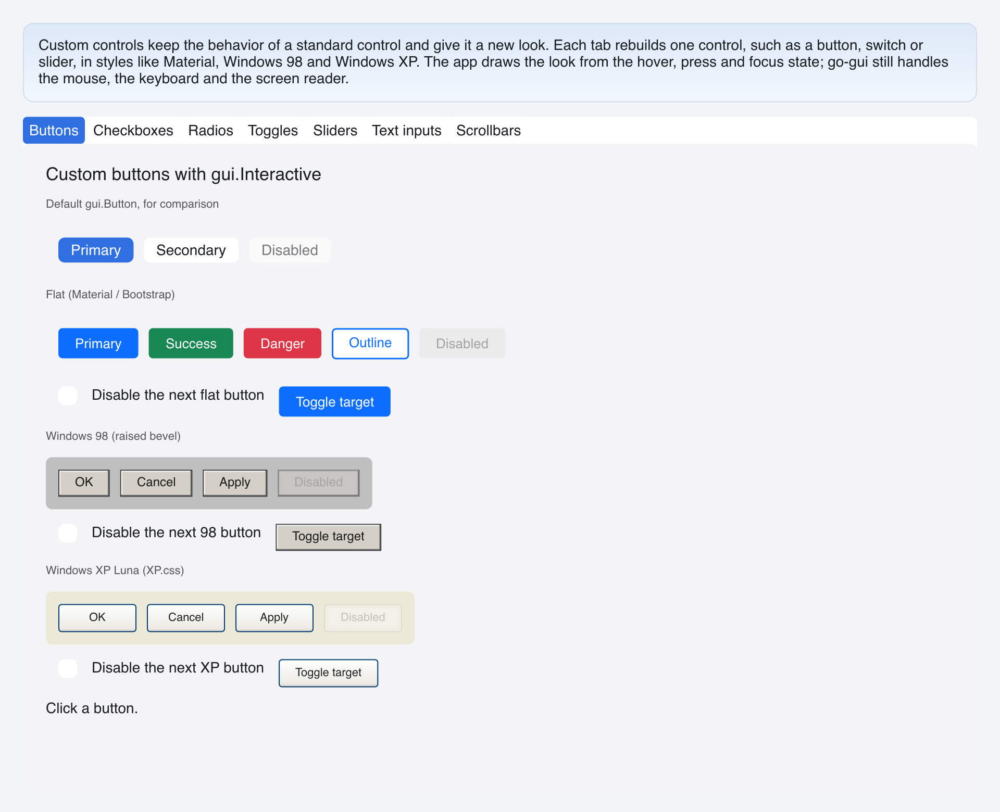

# Custom Controls

> **Framework:** widgets **Description:** Custom buttons, checkboxes, radios,
> toggles, sliders, text inputs and scrollbars in one window, one tab per
> control. Demonstrates `gui.Interactive`, `SliderCfg.Look` and
> `ScrollbarCfg.Thumb`/`Track`.



<!-- explorer: tags=widgets,styling category=widgets run=go -->

---

## Run

```sh
go run ./examples/custom_controls/
```

Open a tab directly with `-tab`:

```sh
go run ./examples/custom_controls/ -tab sliders
```

## What it demonstrates

Ports of go-shirei's custom control demos. Each tab is a package in its own
subfolder, with a README that tells how its looks are built:

| Tab         | Folder                       | Looks                                    |
| ----------- | ---------------------------- | ---------------------------------------- |
| Buttons     | [`buttons/`](buttons/)       | Flat, Windows 98, Windows XP             |
| Checkboxes  | [`checkboxes/`](checkboxes/) | Material, Windows XP                     |
| Radios      | [`radios/`](radios/)         | Material, Windows XP                     |
| Toggles     | [`toggles/`](toggles/)       | Material, iOS-like, check mark, labelled |
| Sliders     | [`sliders/`](sliders/)       | Apple, Material, Windows XP              |
| Text inputs | [`textinputs/`](textinputs/) | Material, Windows XP                     |
| Scrollbars  | [`scrollbars/`](scrollbars/) | Classic, Windows 98, cool blue           |

A page does not read the window state. Each package exports `New`, which makes
the page state, and `View(app)`, which builds the page from it. So all pages
share one window whose state holds the selected tab and one state per page. A
page keeps its state while another tab is shown.

The pages share `internal/look`: the text styles, the page padding and spacing,
the color math (`Darken`, `Lighten`, `Mix`) and `Bevel`. Each page paints its
own light background, so its text styles come from `gui.ThemeLight` and not from
the app theme. Dark text stays on a light page under a dark app theme. The stock
widgets shown for comparison still follow the app theme.

Only the selected tab gets content, so a frame builds one page, not seven.

See `main.go` for the tab control.
