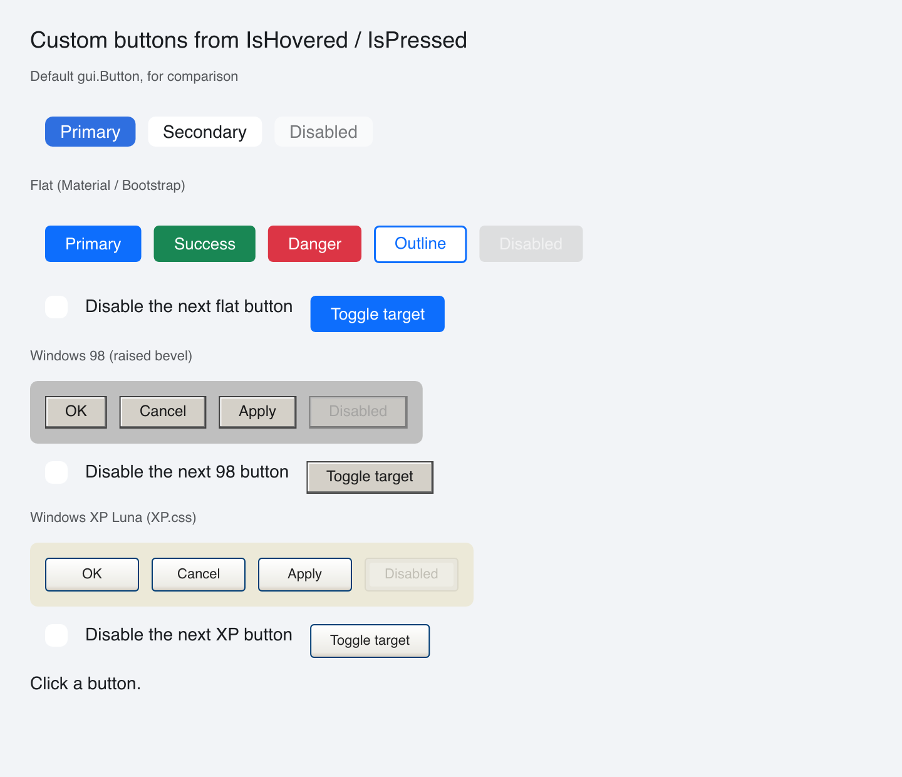

# Custom Buttons

> **Framework:** widgets **Description:** Flat, Windows 98 and Windows XP
> buttons whose look is built from hover and press state. Demonstrates
> `gui.Interactive`, which reads `Window.IsHovered` and `Window.IsPressed` while
> a view is built.



---

## Run

```sh
go run ./examples/custom_controls/ -tab buttons
```

## What it demonstrates

A port of go-shirei's custom-buttons demo. Each custom button is a
`gui.Interactive`. It reads the state of the button and gives it to a builder,
which returns the matching look:

```go
gui.Interactive(id, func(s gui.InteractionState) gui.View {
    return win98Look(id, label, disabled, s, onClick)
})
```

- **Flat** filled buttons need no new API: `gui.Button` takes a color per state.
  The outline button changes its text color on hover, which a color set cannot
  do, so it reads `s.Hovered`.
- **Windows 98** buttons swap the bevel on press and move the label down and
  right by 1px.
- **Windows XP** buttons add a gold rim on hover and flip the gradient on press.

The builder names only the leaf ID. `ok` in the 98 row is `page:win98:ok`,
because the page and the row both carry IDs. `gui.Interactive` resolves that
effective ID itself. The root of the returned view must carry the same ID;
`gui.Debug` reports it when it does not.

Change only what is inside the button's bounds. A look that moves or resizes the
hovered button itself can pull it out from under a still pointer, and the look
then flips every frame. Every look here keeps its outer size fixed: the XP rim
is always there and only changes color.

See `main.go` for the implementation.
