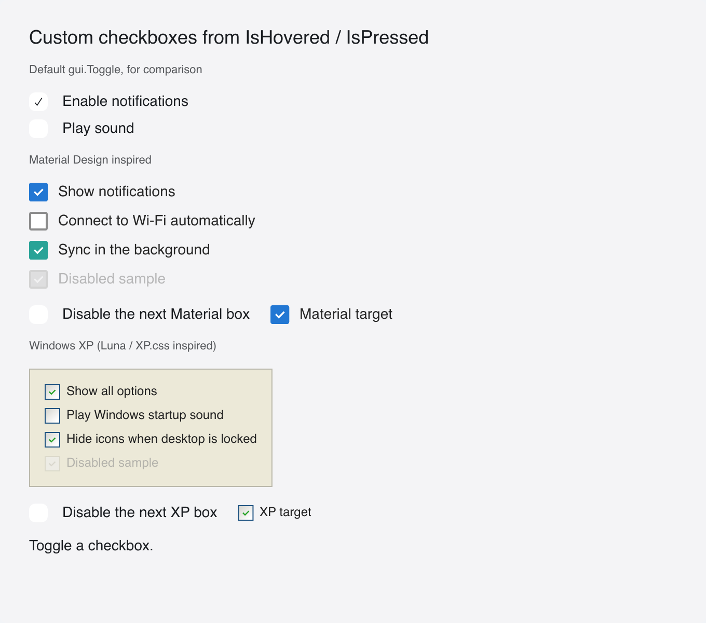

# Custom Checkboxes

> **Framework:** widgets **Description:** Material and Windows XP checkboxes
> whose look is built from hover and press state. Demonstrates `gui.Interactive`
> on a control that holds a value.



---

## Run

```sh
go run ./examples/custom_controls/ -tab checkboxes
```

## What it demonstrates

A port of go-shirei's custom-checkboxes demo. Each checkbox is a
`gui.Interactive` around a row that holds the box and its label, so a click on
the label also toggles it. The app owns the checked value and flips it in
`OnClick`; the look reads it with the hover and press state.

- **Material** is a rounded box with a 2px border. Checked, it fills with the
  accent color and shows a white check mark.
- **Windows XP** is a sunken box from XP.css: a blue frame, a gray-to-white
  face, a gold rim on hover, a darker face while pressed and a green check mark.

`checkShell` gives every checkbox the checkbox role, sets `AccessStateChecked`
when checked, and turns on Space and Enter. A switch under each group disables
the next box, to show a box change between enabled and disabled.

A disabled shape is never hovered, so the look needs no disabled check for the
hover state. It still checks `disabled` for its own colors.

The XP rim is always there and only changes color, so hover never changes the
size of the box.

See `main.go` for the implementation.
