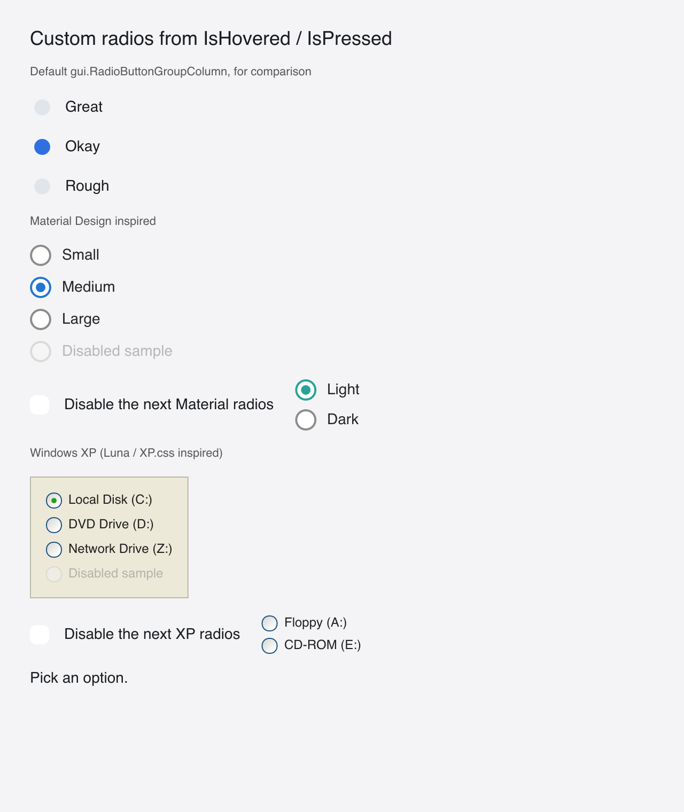

# Custom Radios

> **Framework:** widgets **Description:** Material and Windows XP radio buttons
> whose look is built from hover and press state, with arrow-key navigation.
> Demonstrates `gui.Interactive` for a group of options.



---

## Run

```sh
go run ./examples/custom_controls/ -tab radios
```

## What it demonstrates

A port of go-shirei's custom-radios demo. Each option is a `gui.Interactive`
around a row that holds the circle and its label. The app owns the selected
value; the look reads it with the hover and press state.

- **Material** is an outlined circle, with the accent ring and a solid center
  dot when selected.
- **Windows XP** is a sunken round well from XP.css: a blue ring, a
  gray-to-white face, a gold rim on hover and a small green dot.

A group adds keyboard behavior that one option does not have:

- **Arrow keys.** Down and Right select the next option, Up and Left the
  previous one. The focus follows the selection, disabled options are skipped,
  and the selection wraps around.
- **One Tab stop per group.** Only the selected option is in the Tab order, so
  Tab moves between groups, not between options. A group with no selection uses
  its first enabled option.

A key goes only to the focused shape. It does not travel on to the group, so
each option carries the group's arrow key handler. The handler finds the group's
effective ID with `ctx.EffID` and calls `SetFocus`. A key handler runs with no
frame lock held, so `SetFocus` is allowed there.

`radioShell` gives every option the radio button role and sets
`AccessStateSelected` on the selected one; the group has the radio group role.

See `main.go` for the implementation.
