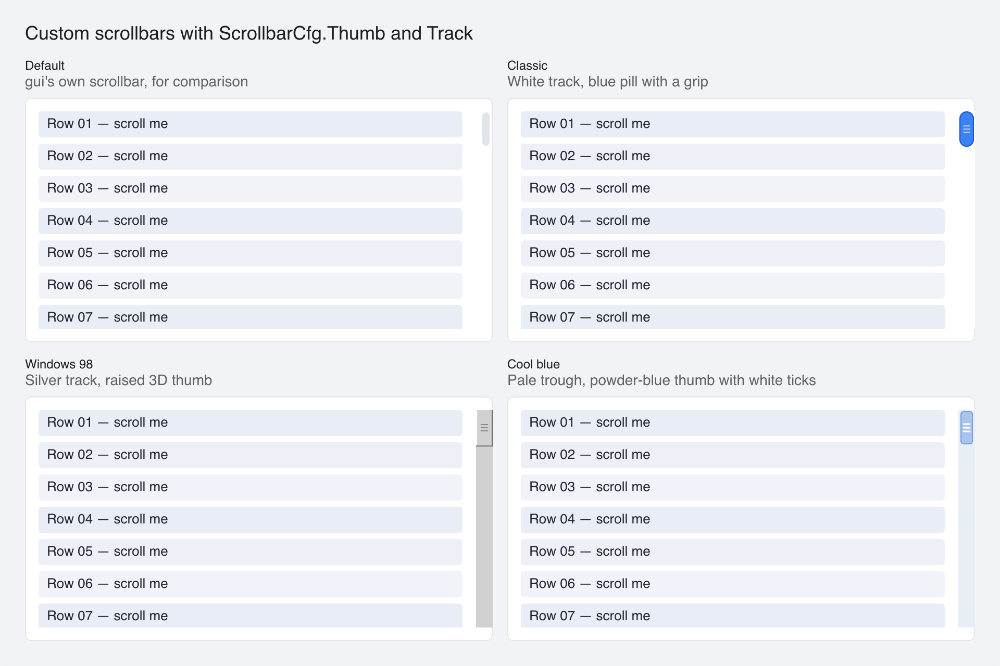

# Custom Scrollbars

> **Framework:** widgets **Description:** Classic, Windows 98 and Cool blue
> scrollbars drawn with `ScrollbarCfg.Thumb` and `ScrollbarCfg.Track`, next to
> the stock one.



---

## Run

```sh
go run ./examples/custom_controls/ -tab scrollbars
```

## What it demonstrates

A port of go-shirei's custom-scrollbars demo. go-shirei's `ScrollBarExt` takes a
`Thumb` function that draws at a size. In go-gui a scrollable container takes a
`ScrollbarCfg` whose `Thumb` and `Track` hooks return views:

```go
gui.Column(gui.ContainerCfg{
    ID: "list", Scrollable: true,
    ScrollbarCfgY: &gui.ScrollbarCfg{
        Size: 16,
        Track: func(gui.ScrollbarState) gui.View { return trough },
        Thumb: func(s gui.ScrollbarState) gui.View { return face(s.Hovered) },
    },
})
```

The scrollbar keeps the scrolling. It sizes and moves the thumb, runs the drag,
jumps on a press in the gutter, and hides the thumb when nothing overflows. The
hooks only draw. `ScrollbarState` has the hover and press state and the size of
the part, so a grip can be a fraction of the thumb's width.

- **Classic** is a white track with a blue pill and a grip, darker under the
  pointer.
- **Windows 98** is a silver track under a raised thumb: a dark layer at the
  bottom and right, a light one at the top and left, and ridges on the face.
- **Cool blue** is a pale trough with a powder-blue thumb, a darker rim and
  white ticks.

Each layer of a thumb has `Fill` sizing, so it takes the thumb's size.

See `main.go` for the implementation.
