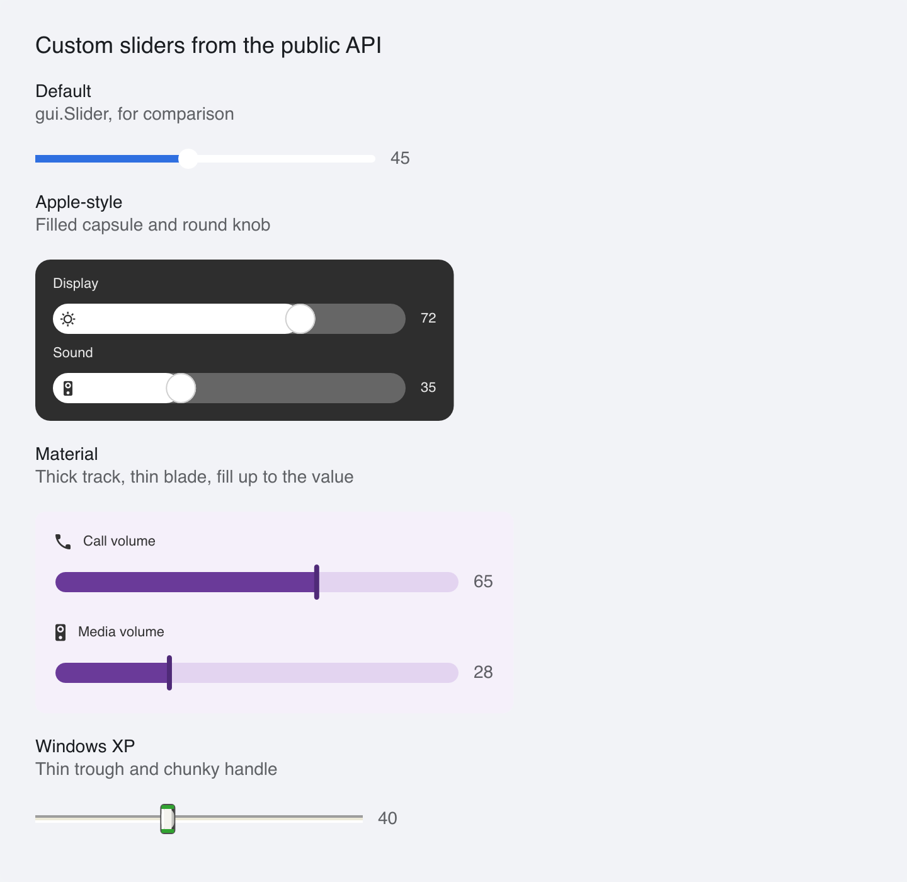

# Custom Sliders

> **Framework:** widgets **Description:** Apple, Material and Windows XP sliders
> drawn with `SliderCfg.Look`: the stock slider's behavior with parts the app
> builds.



---

## Run

```sh
go run ./examples/custom_controls/ -tab sliders
```

## What it demonstrates

A port of go-shirei's custom-sliders demo. go-shirei has `ProcessSlider`, which
handles input and returns the handle position, and the app paints the parts. In
go-gui the input is `gui.Slider` and the paint code is its `Look`:

```go
gui.Slider(gui.SliderCfg{
    ID: "xp", Value: v, Min: 0, Max: 100, Width: 260, Height: 24,
    OnChange: onChange,
    Look: func(s gui.SliderLookState) gui.SliderParts {
        return gui.SliderParts{Track: trough, Handle: handle(s.Hovered)}
    },
})
```

`Look` gets the hover, press and focus state and the value as a fraction. It
returns a `Track`, a `Fill` and a `Handle`. The slider places the fill and the
handle on the track after layout, so drag, arrow keys, Home and End, the mouse
wheel, focus and the screen reader value all come from `gui.Slider`.

- **Apple** is a gray capsule with a white fill and a round knob. The icon sits
  in the fill, at its left end.
- **Material** is a thick track filled up to a thin blade, which widens on focus
  and while dragging. The fill is laid out as wide as the track and clipped at
  the value, so its end at the blade is square.
- **Windows XP** is a thin sunken trough under a handle whose caps turn orange
  under the pointer. It has no fill.

Every slider runs from 0 to 100. The wheel moves a slider by one unit per line,
so a range of 0 to 1 would reach an end on the first turn.

See `main.go` for the implementation.
