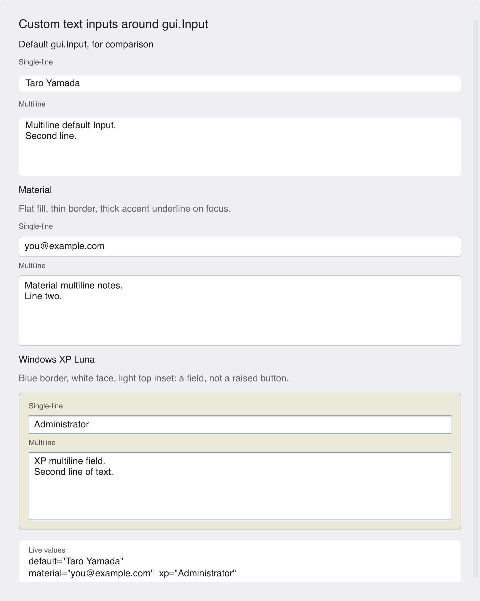

# Custom Text Inputs

> **Framework:** widgets **Description:** Material and Windows XP text fields,
> single-line and multiline, drawn by a wrapper around a `gui.Input` whose own
> chrome is off.



---

## Run

```sh
go run ./examples/custom_controls/ -tab textinputs
```

## What it demonstrates

A port of go-shirei's custom-textinputs demo. go-shirei has `ProcessTextInput`,
which edits the text and returns `HasFocus`. In go-gui the editing is
`gui.Input`. The look is a container around an Input with its background,
border, radius and padding turned off (`plainInput`).

- **Material** is a white field with a thin border and an underline. On focus
  the border and underline take the accent color, and the line grows to 2 px.
- **Windows XP** is a square blue border, a white face and a light line under
  the top border. The border darkens on focus.

The look depends on the focus of the Input, not of the wrapper. The
`InteractionState` from `gui.Interactive` has `FocusWithin`, which is true when
the wrapper or the Input inside it has focus, so the builder reads that:

```go
gui.Interactive(id, func(s gui.InteractionState) gui.View {
    border := xpBorder
    if s.FocusWithin {
        border = xpFocus
    }
    ...
})
```

A press on the wrapper's padding would not reach the Input. The wrapper's
`OnMouseDown` (`focusField`) moves focus to the Input.

See `main.go` for the implementation.
