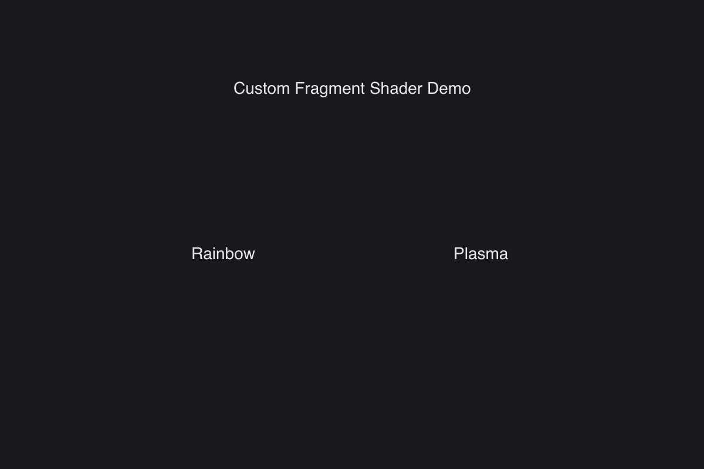

# Custom Shader

> **Framework:** graphics, performance **Description:** Animated fragment
> shaders inside ordinary containers. Requires a GPU and cannot be captured
> headlessly.



<!-- explorer: tags=graphics,performance category=graphics run=go-gpu -->

---

## Run

```sh
go run ./examples/custom_shader/
```

## What it demonstrates

Animated fragment shaders inside ordinary containers. Requires a GPU and cannot
be captured headlessly.

See `main.go` for the implementation.
