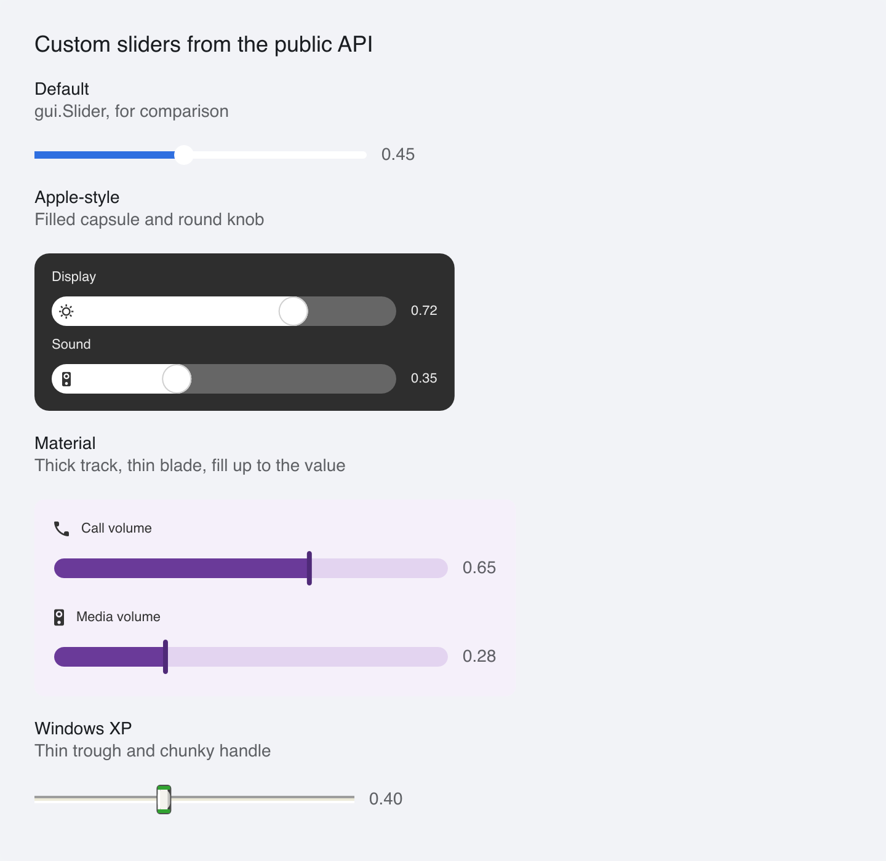

# Custom Sliders

> **Framework:** widgets **Description:** Apple, Material and Windows XP sliders
> built from the public API: a mouse lock drag, arrow keys and floating parts
> placed from the value.



<!-- explorer: tags=widgets,styling,input category=widgets run=go -->

---

## Run

```sh
go run ./examples/custom_sliders/
```

## What it demonstrates

A port of go-shirei's custom-sliders demo. go-shirei has `ProcessSlider`, which
handles input and returns the handle position. go-gui has no such helper, so
`sliderShell` does the same job by hand:

- `OnMouseDown` sets the value under the pointer and starts a `MouseLock` drag.
  The lock reports window coordinates, so the handler saves the track's window X
  and subtracts it.
- `OnKeyDown` moves the value with the arrow keys and jumps to an end with Home
  and End.
- `Focusable` and `AccessRoleSlider` make it a keyboard stop with the slider
  role.

Each look is a `gui.Interactive`. The slider has a fixed width, so the offset of
every part is known while the view is built:

```go
hx := handleX(t, app.value[t.name])
part("knob", hx, 0, knob, knob, knob/2, white)
```

- **Apple** is a gray capsule with a white fill and a round knob.
- **Material** is a thick track filled up to a thin blade, which widens on focus
  and while dragging.
- **Windows XP** is a thin sunken trough under a handle whose caps turn orange
  under the pointer.

Every floating part has an ID. A float is hit-tested in its own layer, so an
ID-less part would hide hover and press from the slider (#661).

## Limits

Two things a custom slider cannot do with the public API today:

- **Mouse wheel.** `ContainerCfg` has no `OnMouseScroll`.
- **Value for a screen reader.** The role is set, but the value, minimum and
  maximum are in an unexported field.

See `main.go` for the implementation.
