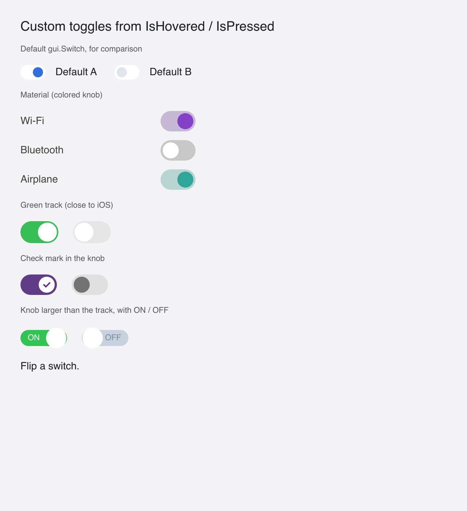

# Custom Toggles

> **Framework:** widgets **Description:** Material, iOS-like, check-mark and
> labelled switches whose look is built from hover and press state. Demonstrates
> `gui.Interactive` on a control that holds a value.



<!-- explorer: tags=widgets,styling category=widgets run=go -->

---

## Run

```sh
go run ./examples/custom_toggles/
```

## What it demonstrates

A port of go-shirei's custom-toggles demo. A switch works like a button: a
click, Space or Enter runs `OnClick`. The difference is the value. The app owns
it, flips it in `OnClick`, and gives it to the look together with the hover and
press state from `gui.Interactive`:

```go
gui.Interactive(id, func(s gui.InteractionState) gui.View {
    track := greenOff
    if on {
        track = greenOn
    }
    ...
})
```

- **Material** has a tinted track and a solid accent knob when on.
- **Green** is the iOS look: a green track and a white knob.
- **Check mark** puts a check mark in the knob when on.
- **Labelled** has a knob taller than its track, with ON or OFF in the free half
  of the track.

`switchShell` gives every switch the switch role and sets `AccessStateChecked`
when it is on, so a screen reader reads the value.

The knob moves by alignment: the track aligns its knob left when off and right
when on. No float or `AmendLayout` is needed, and the outer size never changes.

The labelled switch is the exception, because its knob is taller than the track.
There the knob floats over the track. A float is hit-tested in its own layer, so
the knob has an ID (`knob`). Without an ID, the pointer over the knob finds no
hover target and the track loses its hover shade. A click reaches the switch
either way (#661).

See `main.go` for the implementation.
