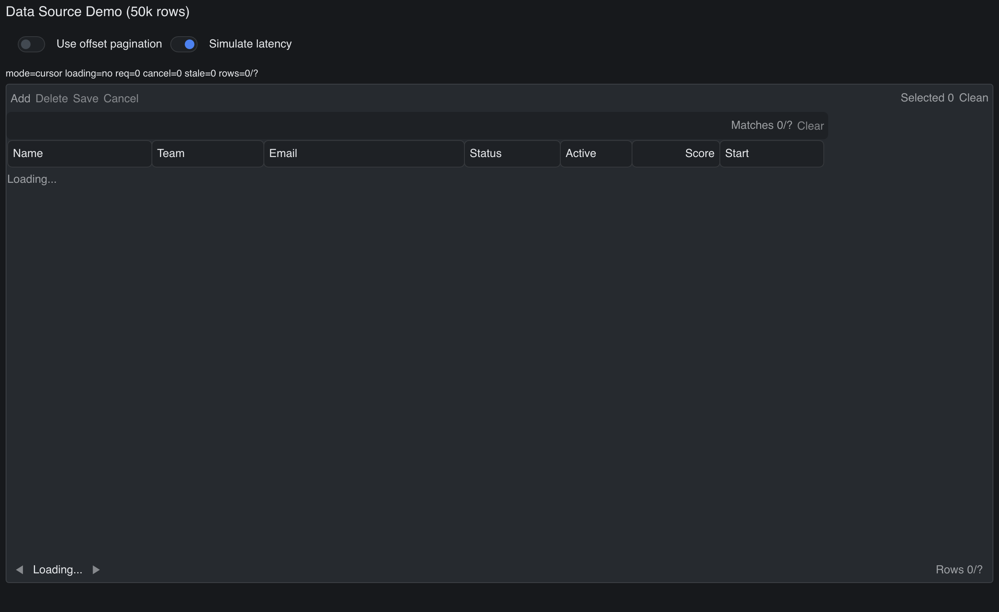

# Data Grid Data Source

> **Framework:** data, performance **Description:** Large data grid backed by a
> paged in-memory source. Shows sorting, filtering, and virtualized row
> rendering.



<!-- explorer: tags=data,performance category=data run=go -->

---

## Run

```sh
go run ./examples/data_grid_data_source/
```

## What it demonstrates

Large data grid backed by a paged in-memory source. Shows sorting, filtering,
and virtualized row rendering.

See `main.go` for the implementation.
