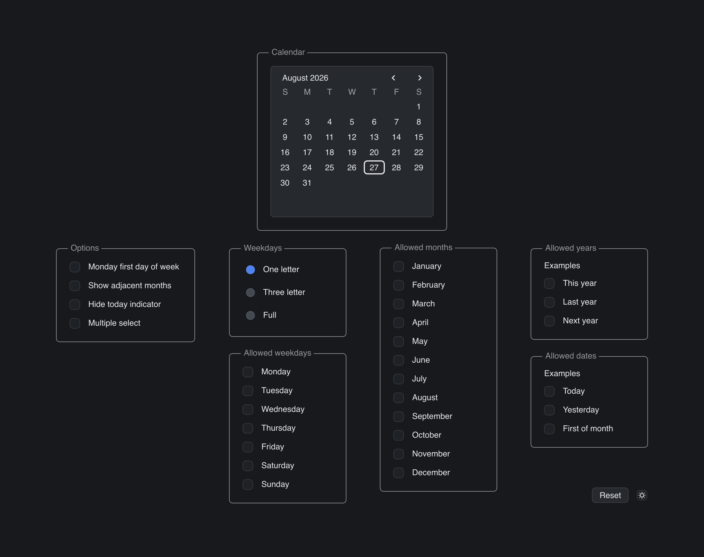

# Date Picker Options

> **Framework:** input, selection **Description:** DatePicker with toggleable
> options and filters for weekday, month, and year. Includes theme switching.



<!-- explorer: tags=input,selection category=input run=go -->

---

## Run

```sh
go run ./examples/date_picker_options/
```

## What it demonstrates

DatePicker with toggleable options and filters for weekday, month, and year.
Includes theme switching.

See `main.go` for the implementation.
