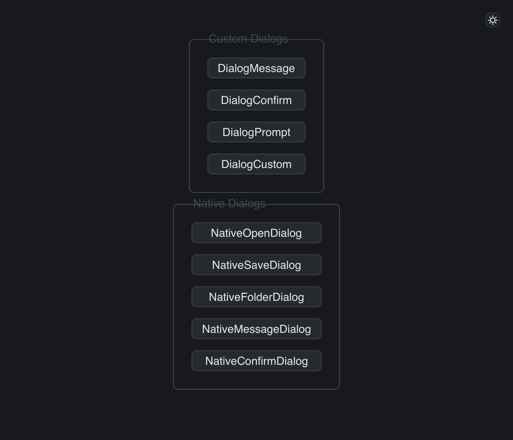

# Dialogs

> **Framework:** system **Description:** Custom dialogs and native file dialogs.
> Shows modal layout, focus handling, and platform integration.



<!-- explorer: tags=system category=system run=go -->

---

## Run

```sh
go run ./examples/dialogs/
```

## What it demonstrates

Custom dialogs and native file dialogs. Shows modal layout, focus handling, and
platform integration.

See `main.go` for the implementation.
