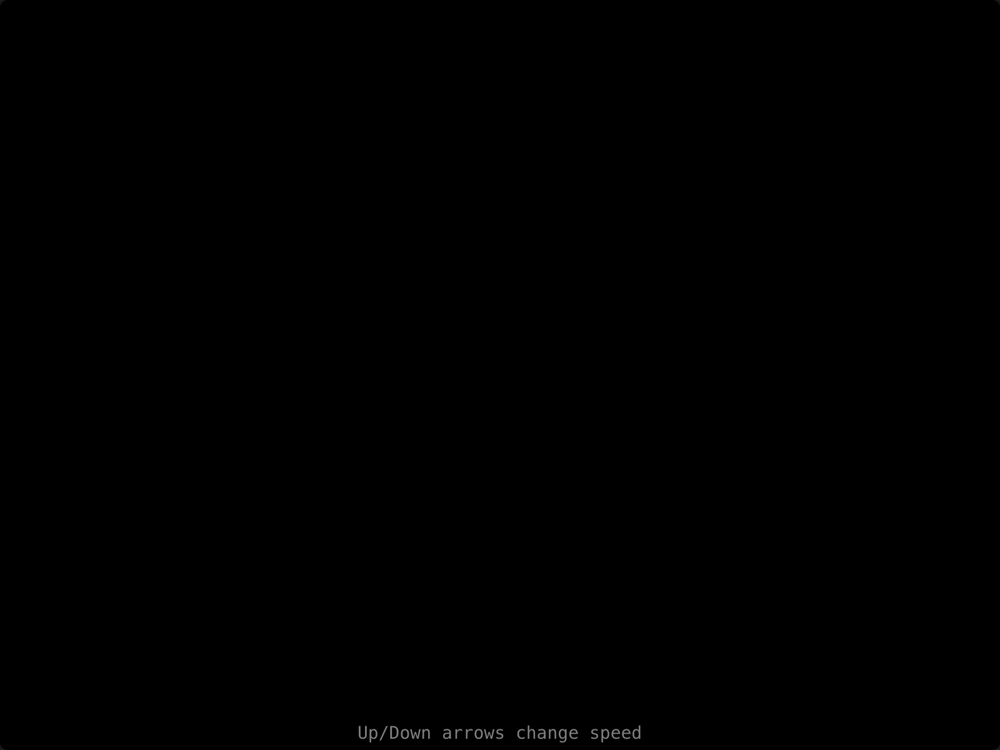

# Digital Rain

> **Framework:** graphics, animation **Description:** Falling-character effect
> from The Matrix. Animates glyphs with color and speed variation on a canvas.



<!-- explorer: tags=graphics,animation category=graphics run=go -->

---

## Run

```sh
go run ./examples/digital_rain/
```

## What it demonstrates

Falling-character effect from The Matrix. Animates glyphs with color and speed
variation on a canvas.

See `main.go` for the implementation.
