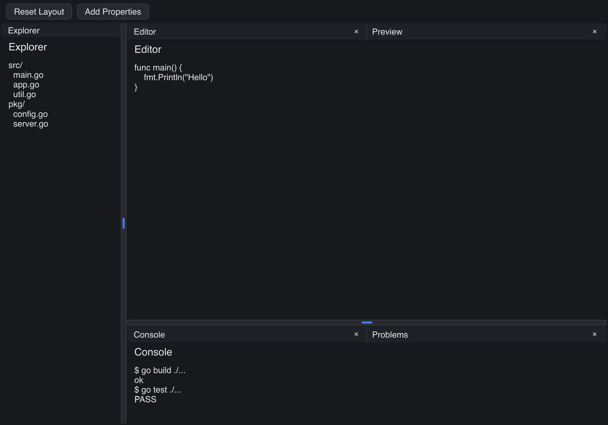

# Dock Layout

> **Framework:** layout **Description:** IDE-style dock with splits, tabs,
> drag-and-drop, and closable panels. Demonstrates DockLayout composition and
> state.



<!-- explorer: tags=layout category=layout run=go -->

---

## Run

```sh
go run ./examples/dock_layout/
```

## What it demonstrates

IDE-style dock with splits, tabs, drag-and-drop, and closable panels.
Demonstrates DockLayout composition and state.

See `main.go` for the implementation.
