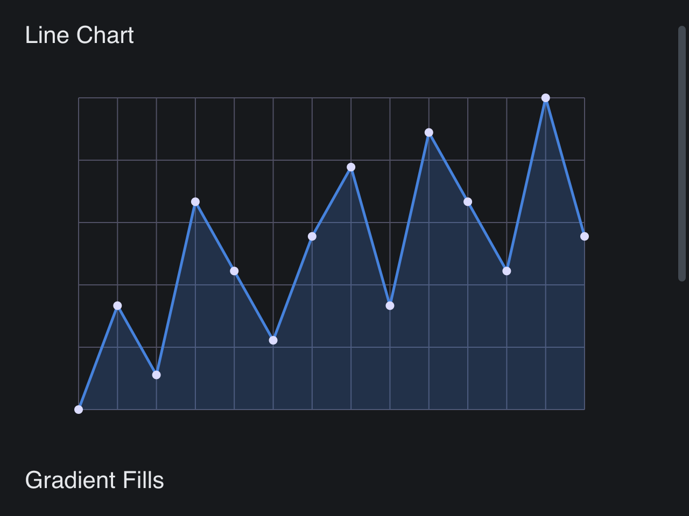

# Draw Canvas

> **Framework:** graphics **Description:** Line chart and gradient fills using
> DrawCanvas and DrawContext. Shows flat and gradient rendering primitives.



<!-- explorer: tags=graphics category=graphics run=go -->

---

## Run

```sh
go run ./examples/draw_canvas/
```

## What it demonstrates

Line chart and gradient fills using DrawCanvas and DrawContext. Shows flat and
gradient rendering primitives.

See `main.go` for the implementation.
