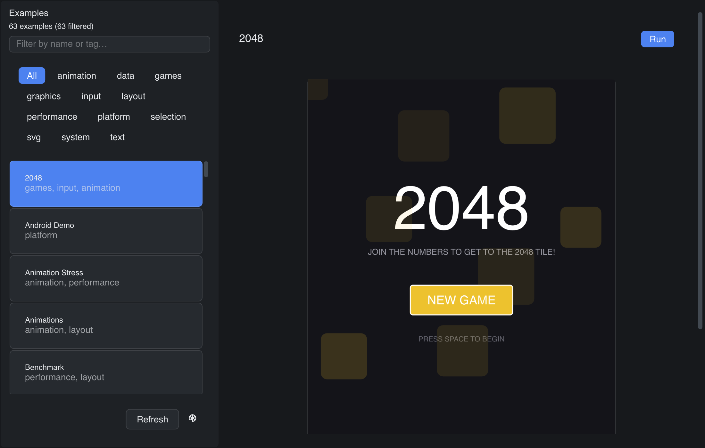

# Explorer

> **Framework:** system **Description:** Gallery that lists, previews, and runs
> every example. Discovers READMEs and screenshots on disk.



<!-- explorer: tags=system category=system run=go -->

---

## Run

```sh
go run ./examples/explorer/
```

## What it demonstrates

Gallery that lists, previews, and runs every example. Discovers READMEs and
screenshots on disk.

See `main.go` for the implementation.
