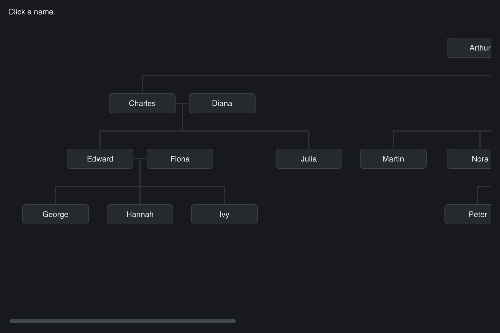

# Family Tree

> **Framework:** layout **Description:** Scrollable family tree with clickable
> names and orthogonal connector lines. Demonstrates Canvas, DrawCanvas, and
> absolute child positions inside a scroll container.



<!-- explorer: tags=layout,graphics category=layout run=go -->

---

## Run

```sh
go run ./examples/family_tree/
```

## What it demonstrates

A diagram larger than the window, built from three parts:

- `gui.Canvas` does not arrange its children. Each name is placed at its own
  `X`/`Y`.
- `gui.DrawCanvas` is the first child, so it paints the connector lines under
  the names.
- A scrollable `gui.Column` around the canvas scrolls on both axes.

The names are buttons, so click, hover, focus and accessibility work without
hit-testing code.

Give the canvas an explicit `Width` and `Height` that cover the whole diagram. A
container that does not arrange its children measures its scroll range from
child sizes only. It ignores child `X`/`Y`, so without an explicit size the
names past the window edge cannot be scrolled into view.

Set `Clip: true` on the scroll column. Without it the canvas's fixed width
becomes the column's minimum width, the column grows as wide as the tree, and
there is no horizontal scroll range.

To scroll sideways, use Shift with the mouse wheel or trackpad, or drag the
scrollbar. A plain sideways trackpad swipe does not scroll yet.

See `main.go` for the implementation.
