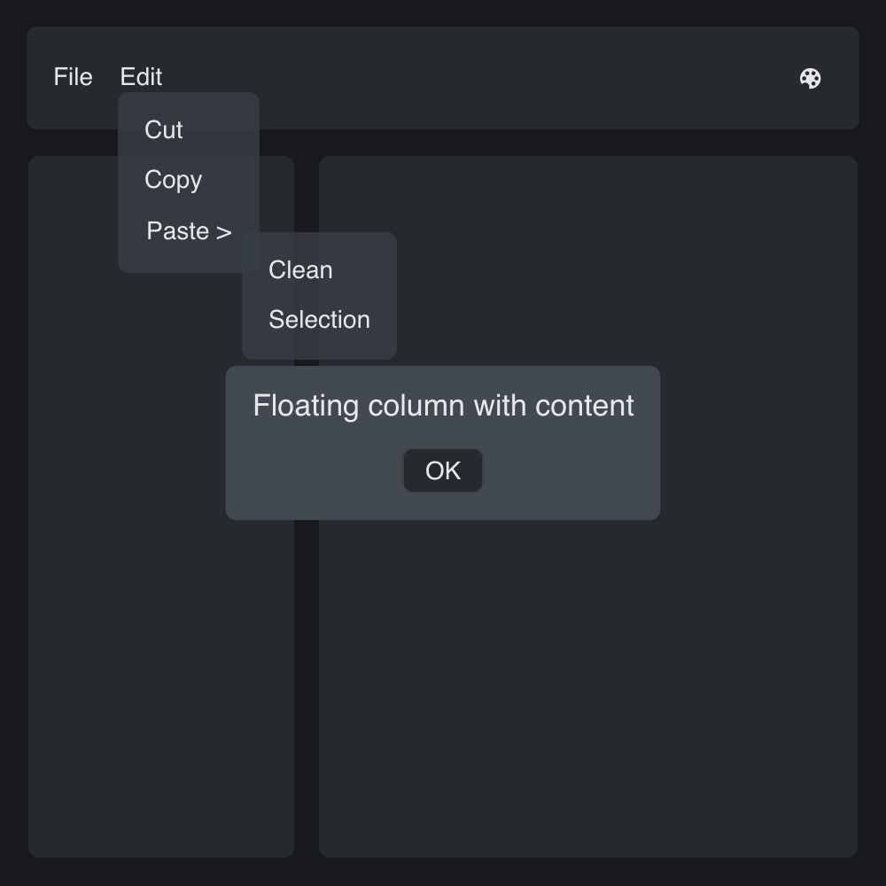

# Floating Layout

> **Framework:** layout **Description:** Anchored overlays positioned over
> parent content. Demonstrates FloatAnchor, FloatTieOff, and offsets.



<!-- explorer: tags=layout category=layout run=go -->

---

## Run

```sh
go run ./examples/floating_layout/
```

## What it demonstrates

Anchored overlays positioned over parent content. Demonstrates FloatAnchor,
FloatTieOff, and offsets.

See `main.go` for the implementation.
