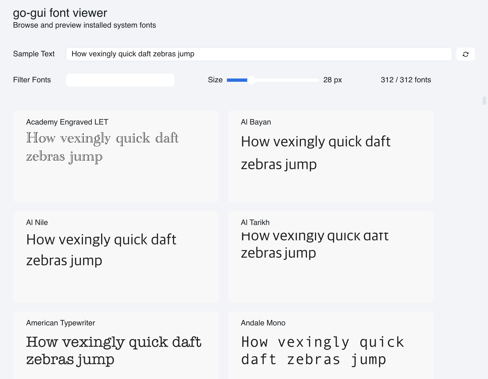

# Font Viewer

> **Framework:** text, data, performance **Description:** Browsable catalog of
> system fonts in a virtualized grid. Filter fonts, adjust size, and copy names.



<!-- explorer: tags=text,data,performance category=text run=go -->

---

## Run

```sh
go run ./examples/fontviewer/
```

## What it demonstrates

Browsable catalog of system fonts in a virtualized grid. Filter fonts, adjust
size, and copy names.

See `main.go` for the implementation.
