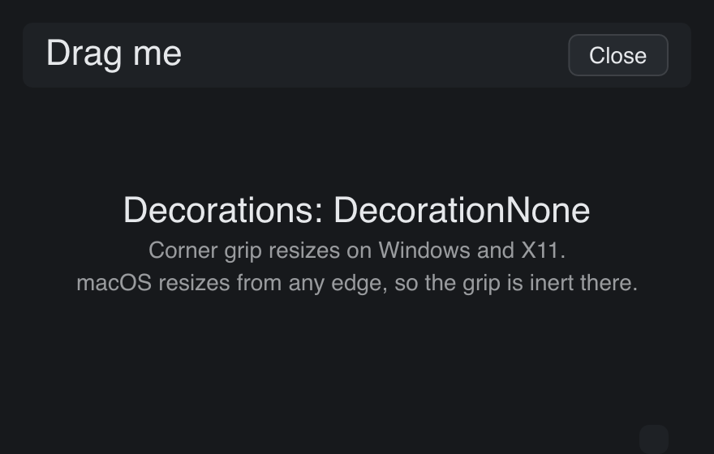

# Frameless

> **Framework:** system, platform **Description:** Window with no native title
> bar or border, moved and resized by the app through native gestures.



<!-- explorer: tags=system,platform category=system run=go -->

---

## Run

```sh
go run ./examples/frameless/
```

Add `-hidden-titlebar` for the macOS variant that keeps the window controls
floating over the content:

```sh
go run ./examples/frameless/ -hidden-titlebar
```

## What it demonstrates

`WindowCfg.Decorations` selects the native frame. `DecorationNone` removes it
completely, so the app draws its own header and supplies the gestures the frame
used to provide:

- The header strip calls `Window.StartWindowDrag` on mouse-down, which hands the
  move to the OS. Window snapping and edge tiling keep working.
- The corner grip calls `Window.StartWindowResize(gui.EdgeBottomRight)`. macOS
  needs no grip, because a borderless window still resizes from any edge, so the
  call is a no-op there.

See `main.go` for the implementation.
