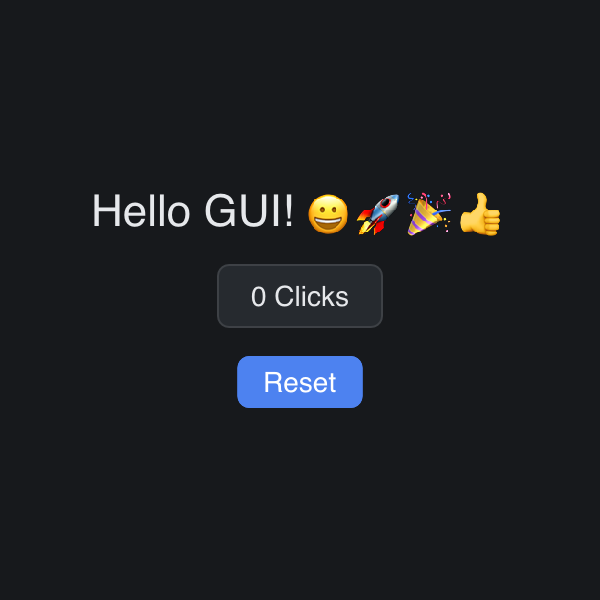

# Get Started

> **Framework:** input **Description:** The smallest stateful app: one button
> and one counter. Shows State, UpdateView, and event handling.



<!-- explorer: tags=input category=input run=go -->

---

## Run

```sh
go run ./examples/get_started/
```

## What it demonstrates

The smallest stateful app: one button and one counter. Shows State, UpdateView,
and event handling.

See `main.go` for the implementation.
