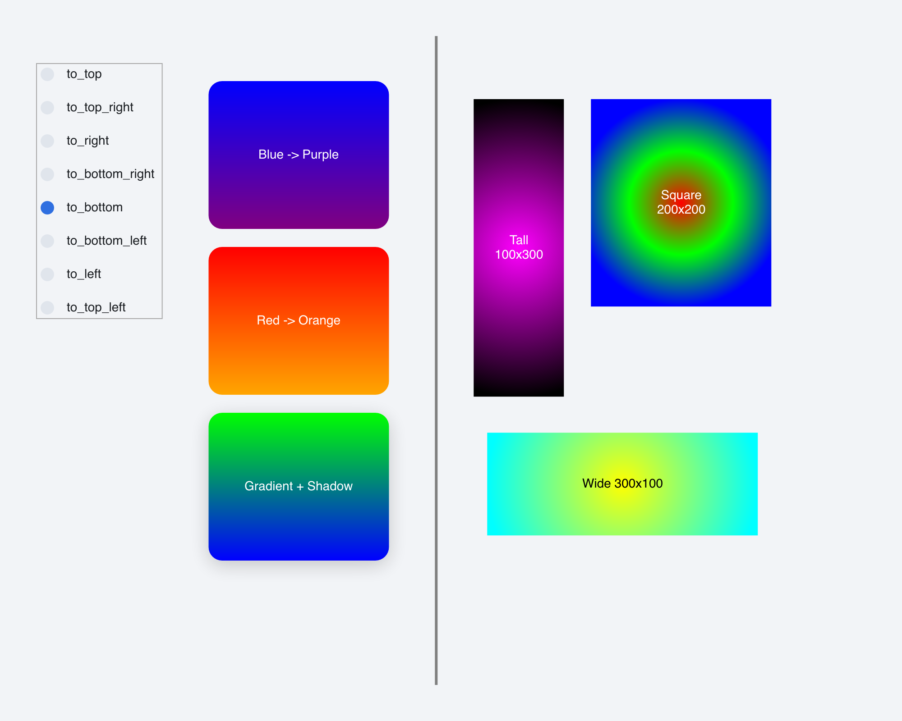

# Gradient Demo

> **Framework:** graphics, theme **Description:** Built-in gradient directions
> with runtime switching. Compares fill types across shapes.



<!-- explorer: tags=graphics,theme category=graphics run=go -->

---

## Run

```sh
go run ./examples/gradient_demo/
```

## What it demonstrates

Built-in gradient directions with runtime switching. Compares fill types across
shapes.

See `main.go` for the implementation.
