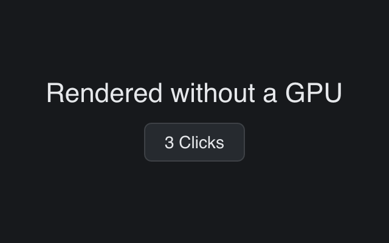

# Headless PNG

> **Framework:** system, graphics **Description:** Renders a window to PNG with
> no GPU or window. Uses gui/backend/soft to rasterize RenderCmd on CPU.



<!-- explorer: tags=system,graphics category=system run=go -->

---

# headless_png

Renders a window to a PNG with no GPU and no window on screen. It uses the
software rasterizer in `gui/backend/soft`.

```
go run ./examples/headless_png/            # writes headless.png
go run ./examples/headless_png/ shot.png   # writes shot.png
```

The window is built exactly as it is for `backend.Run` — the same
`gui.SimpleWindow`, the same view function. `soft.RenderToPNG` runs `OnInit`,
settles one frame, and rasterizes it on the CPU. The only difference from a real
run is the last step.

The `2` in `soft.RenderToPNG(w, 2, out)` is the device pixel ratio: `1` gives
one device pixel per logical pixel, `2` captures at Retina density.

Useful for CI screenshots and pixel-level regression tests. See
`docs/specs/headless-software-rendering.md` for what the renderer covers. SVG,
shadow, blur and filter commands are skipped in this phase.
