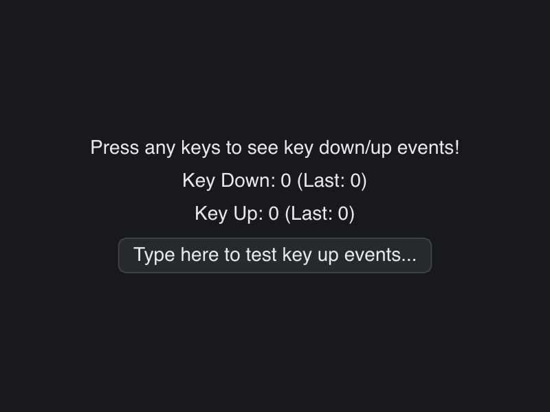

# Key Up Demo

> **Framework:** input, system **Description:** Key-down and key-up handling.
> Shows which keys repeat and how to track held keys.



<!-- explorer: tags=input,system category=input run=go -->

---

## Run

```sh
go run ./examples/key_up_demo/
```

## What it demonstrates

Key-down and key-up handling. Shows which keys repeat and how to track held
keys.

See `main.go` for the implementation.
