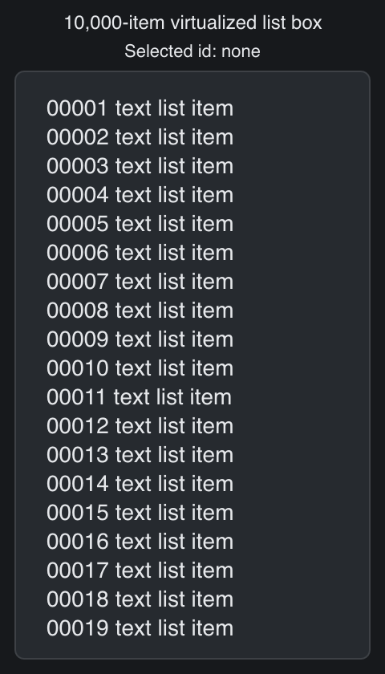

# Listbox

> **Framework:** selection, data, performance **Description:** Virtualized list
> with a large option set and simple selection. Demonstrates scrolling and
> keyboard navigation.



<!-- explorer: tags=selection,data,performance category=selection run=go -->

---

## Run

```sh
go run ./examples/listbox/
```

## What it demonstrates

Virtualized list with a large option set and simple selection. Demonstrates
scrolling and keyboard navigation.

See `main.go` for the implementation.
