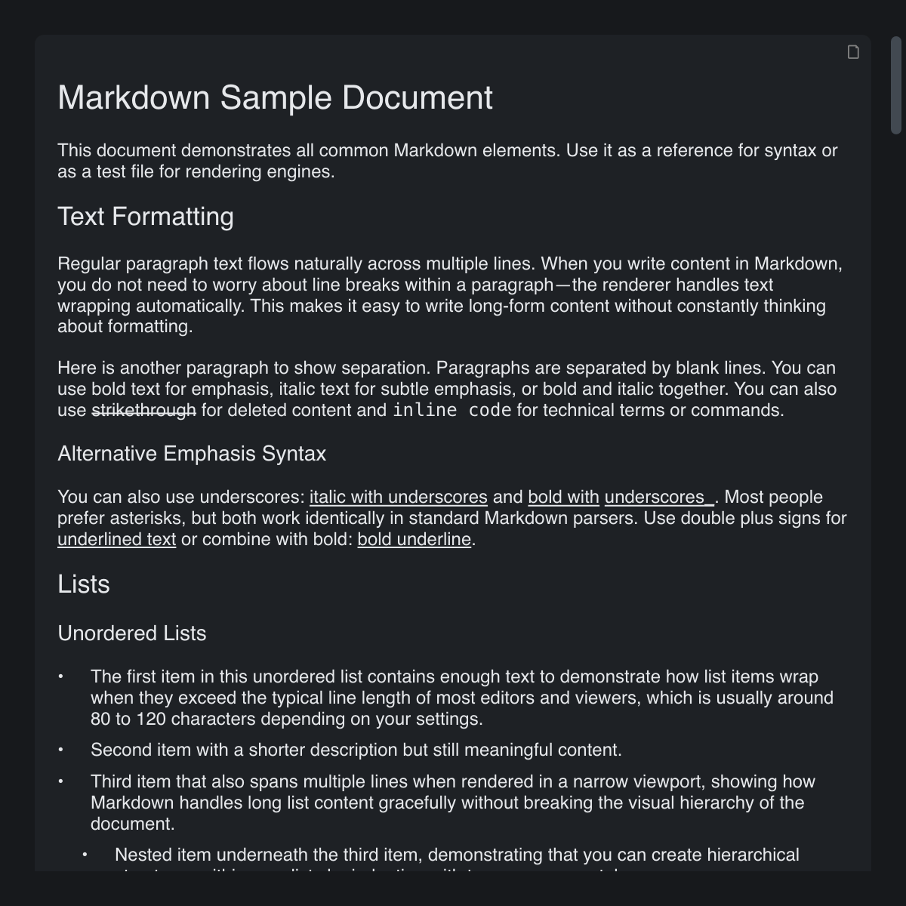

# Markdown

> **Framework:** text **Description:** Embedded markdown document rendered with
> the Markdown view. Shows headings, lists, code, and tables.



<!-- explorer: tags=text category=text run=go -->

---

## Run

```sh
go run ./examples/markdown/
```

## What it demonstrates

Embedded markdown document rendered with the Markdown view. Shows headings,
lists, code, and tables.

See `main.go` for the implementation.
