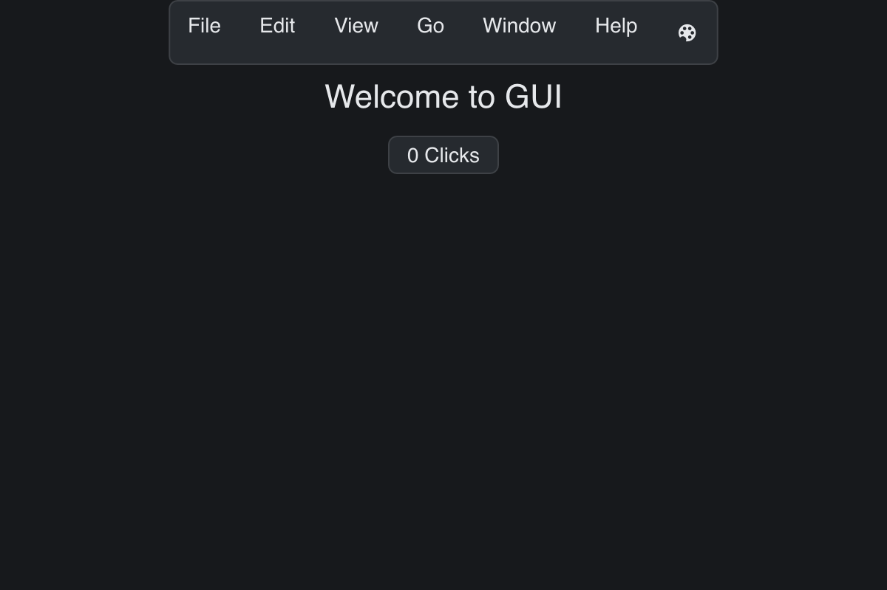

# Menu Demo

> **Framework:** system **Description:** Menu bar with nested items and stateful
> actions. Demonstrates menu construction and command wiring.



<!-- explorer: tags=system category=system run=go -->

---

## Run

```sh
go run ./examples/menu_demo/
```

## What it demonstrates

Menu bar with nested items and stateful actions. Demonstrates menu construction
and command wiring.

See `main.go` for the implementation.
