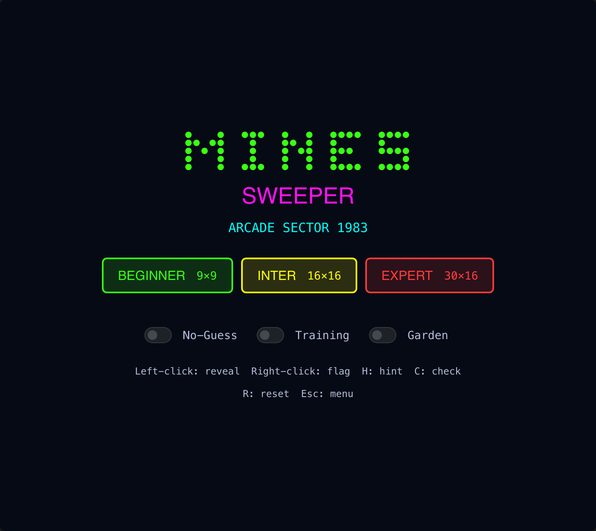

# Minesweeper

> **Framework:** games **Description:** Complete Minesweeper with no-guess mode,
> hints, and training. Includes a themed board and scoring.



<!-- explorer: tags=games category=games run=go -->

---

## Run

```sh
go run ./examples/minesweeper/
```

## What it demonstrates

Complete Minesweeper with no-guess mode, hints, and training. Includes a themed
board and scoring.

See `main.go` for the implementation.
