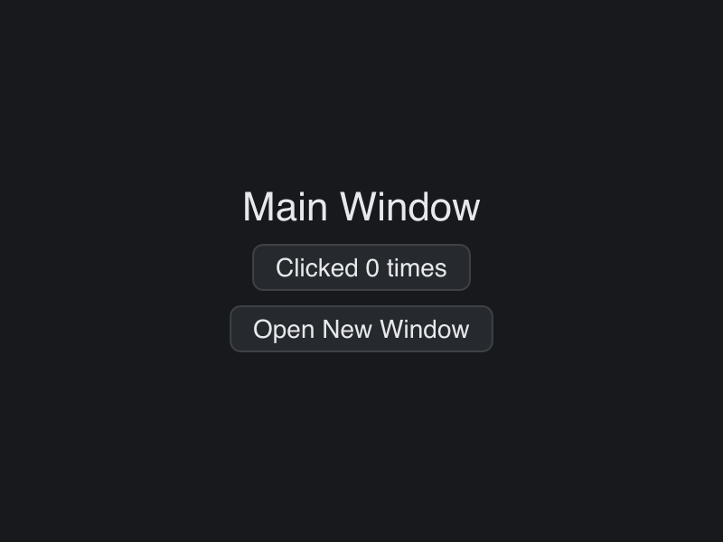

# Multi Window

> **Framework:** system **Description:** Two windows with independent state and
> cross-window messaging. Shows runtime window creation.



<!-- explorer: tags=system category=system run=go -->

---

## Run

```sh
go run ./examples/multi_window/
```

## What it demonstrates

Two windows with independent state and cross-window messaging. Shows runtime
window creation.

See `main.go` for the implementation.
