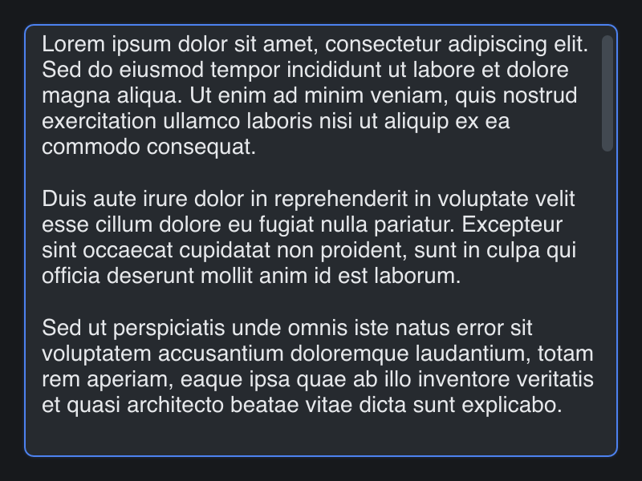

# Multiline Input

> **Framework:** input, text **Description:** Multiline text editing with
> cursor, selection, clipboard, and scrolling. Playground for input behavior.



<!-- explorer: tags=input,text category=input run=go -->

---

## Run

```sh
go run ./examples/multiline_input/
```

## What it demonstrates

Multiline text editing with cursor, selection, clipboard, and scrolling.
Playground for input behavior.

See `main.go` for the implementation.
