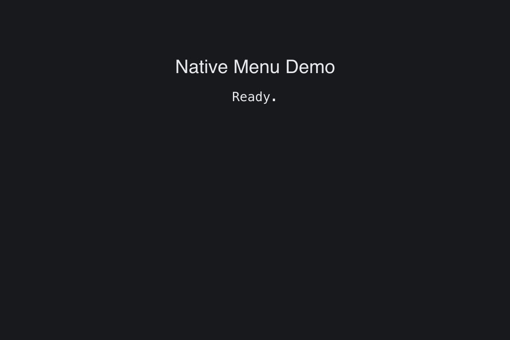

# Native Menu

> **Framework:** system, platform **Description:** Native macOS menubar with
> auto-wired Edit menu and command integration. Platform-specific example.



<!-- explorer: tags=system,platform category=system run=go -->

---

## Run

```sh
go run ./examples/native_menu/
```

## What it demonstrates

Native macOS menubar with auto-wired Edit menu and command integration.
Platform-specific example.

See `main.go` for the implementation.
