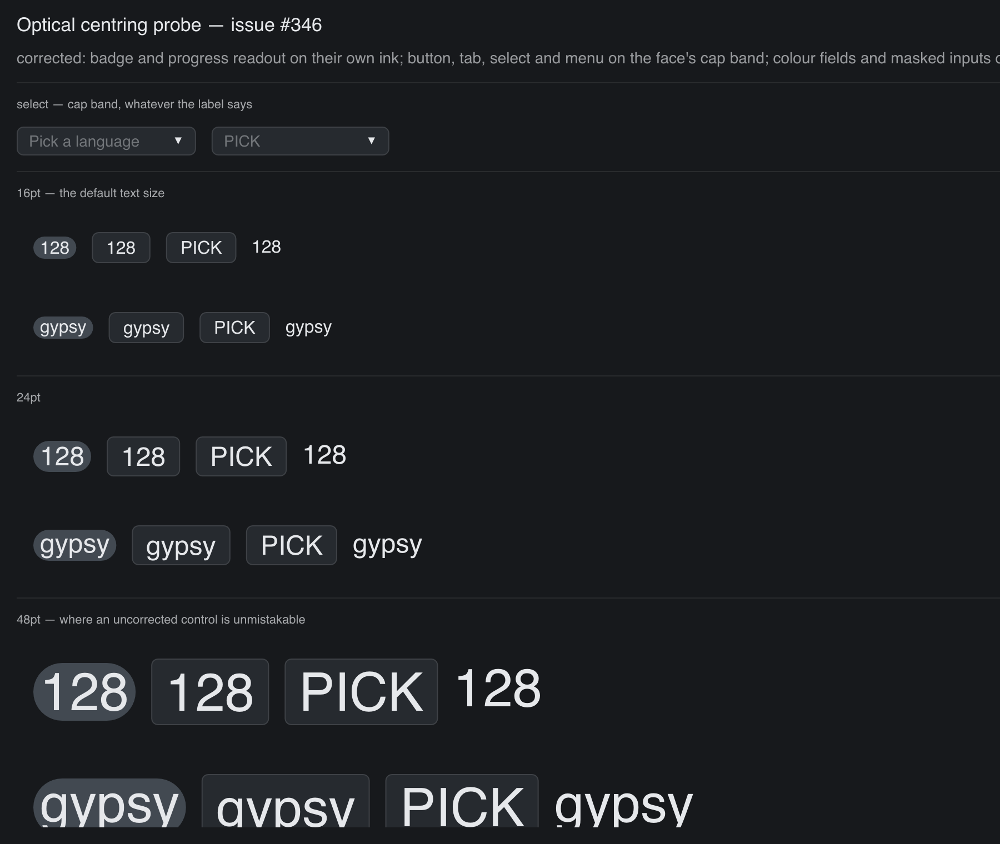

# Optical Centring

> **Framework:** text, theme **Description:** Probe for vertical centring of
> descender-free text. Shows optical correction on Badge and ProgressBar.



<!-- explorer: tags=text,theme category=text run=go -->

---

## Run

```sh
go run ./examples/optical_centring/
```

## What it demonstrates

Probe for vertical centring of descender-free text. Shows optical correction on
Badge and ProgressBar.

See `main.go` for the implementation.
