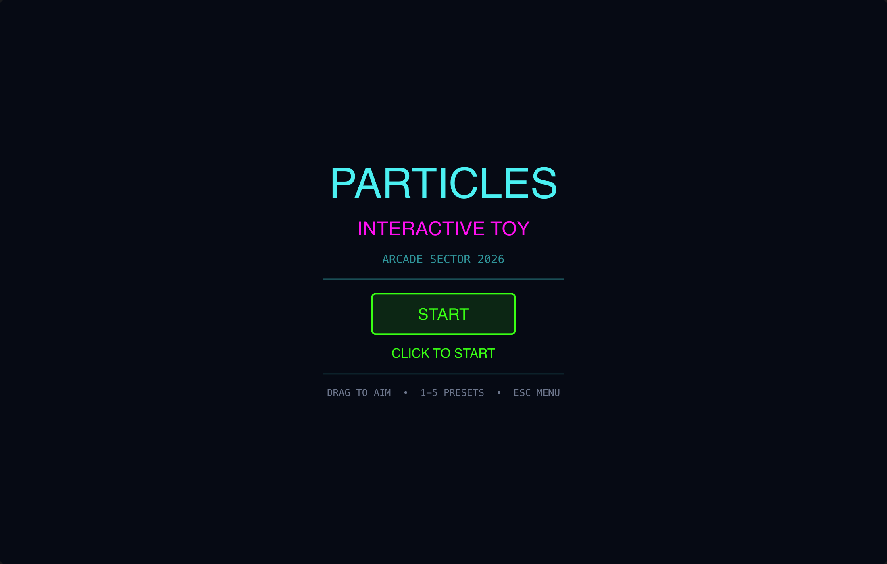

# Particles

> **Framework:** graphics, animation **Description:** Interactive particle
> simulation with configurable physics and presets. Drag to move the emitter.



<!-- explorer: tags=graphics,animation category=graphics run=go -->

---

## Run

```sh
go run ./examples/particles/
```

## What it demonstrates

Interactive particle simulation with configurable physics and presets. Drag to
move the emitter.

See `main.go` for the implementation.
