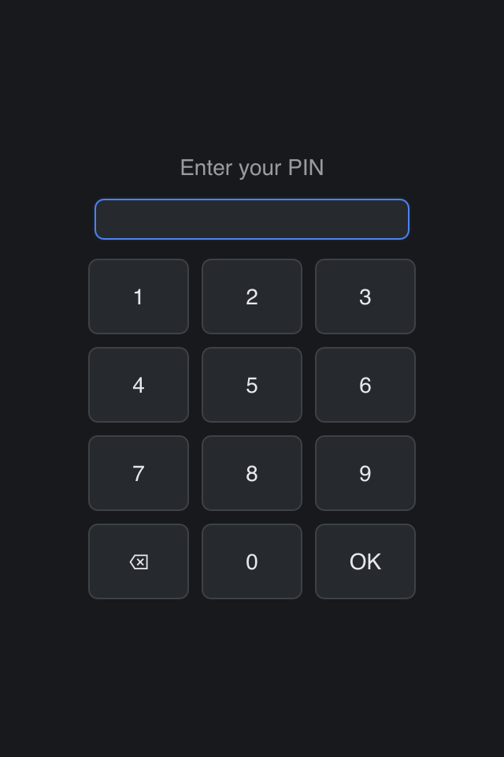

# PIN Pad

> **Framework:** input, platform **Description:** An app-drawn PIN pad that
> types into a focused Input while the OS soft keyboard stays down.



<!-- explorer: tags=input,platform category=input run=go -->

---

## Run

```sh
go run ./examples/pin_pad/
```

## What it demonstrates

A custom keypad for a kiosk or a PIN entry screen, built from ordinary widgets
(issue #770):

- The field sets `Keyboard: gui.KeyboardNone`. It keeps focus and its caret, but
  a touch platform does not open its own keyboard over the pad.
- Each key is a `FocusDisabled` button. A press that a non-focusable widget
  consumes does not take focus from the field.
- A key sends the same event as a physical key: `EventChar` for a digit,
  `EventKeyDown` for Backspace and Enter. It sends it through `QueueCommand` +
  `Window.EventFn`, so `PreTextChange`, the caret and `OnTextChanged` work as
  they do for typing.
- The view adds `Window.SoftKeyboardInset()` to its bottom padding, so the pad
  stays above an OS keyboard if one opens.

See `main.go` for the implementation.
