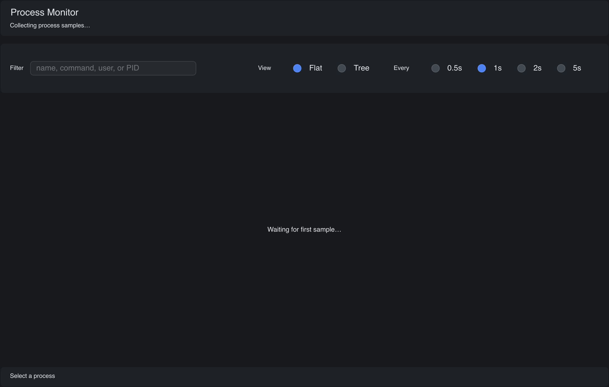

# Process Monitor

> **Framework:** data, system **Description:** Live process list with sortable
> columns and CPU and RAM history charts. Updates from system stats.



<!-- explorer: tags=data,system category=data run=go -->

---

# process_monitor

A small live task manager: a filterable process list, flat and tree views,
sortable columns, and per-process CPU/RAM history charts. It runs on go-gui's
immediate-mode pipeline and takes all its styling from the standard theme
tokens.

It is a functional port of the [go-shirei `process_monitor`][shirei] example.
The goal is feature parity, not a pixel-for-pixel visual match. The layout takes
cues from other go-gui examples. The colors come from `gui.ThemeDark` /
`gui.ThemeLight`, not hand-picked HSL values.

[shirei]: https://go.hasen.dev

## Features

- Live process list: PID, CPU%, RSS, MEM%, USER, STATE, THREADS, NAME.
- Click a column header to sort. Click it again to reverse.
- Select a row for a detail panel with ~60s rolling CPU and RAM charts.
- Filter box that matches name, command line, user, or PID (substring,
  case-insensitive).
- Flat list **or** parent/child tree. Collapse a subtree with ▸/▾. An active
  filter keeps the ancestors of matched processes visible.
- Sample-interval selector: 0.5s / 1s / 2s / 5s.
- Metrics that the OS does not report render `--`, never a fake `0`.
- System memory bar in the header (shown only when the platform reports totals).

## Run it

```shell
go run ./examples/process_monitor              # open the GUI
go run ./examples/process_monitor -once        # print one report and exit
go run ./examples/process_monitor -once -limit 20 -sort mem
```

Flags: `-once`, `-limit N`, `-sort cpu|mem|pid|name|user|state|threads`,
`-refresh D` (GUI interval, snapped to the nearest preset).

## How it works

### Dependency-free data collection

go-gui examples share the root module, so this example pulls in no third-party
process library. It shells out to the OS instead:

- **macOS / Linux** — parse `ps` (`collect_unix.go`). Linux also reports the
  thread count via `nlwp`. macOS `ps` has no thread column, so THREADS shows
  `--` there.
- **Windows** — parse `tasklist` CSV (`collect_windows.go`). One call does not
  provide a live CPU%, so CPU shows `--`.
- System memory totals come from `/proc/meminfo` (Linux) or `sysctl` + `vm_stat`
  (macOS). Other platforms omit the memory bar.

Process start times feed the store's (PID, StartTime) identity, which guards
against PID reuse: `etimes` on Linux, `lstart` on macOS, and the process
creation time (via `GetProcessTimes`, no extra subprocess) on Windows. A row
whose start time the OS refuses to report falls back to PID-only.

**CPU% caveat:** on Unix the value is `ps`'s `%cpu`, which is a _lifetime
average_, not an instantaneous interval rate. It is a real, useful number that
needs only one sample. A delta-based interval CPU% is the enhancement. It
requires two cumulative-CPU-time reads.

### Background sampling, UI only reads

Sampling spawns a subprocess, so it runs on a background goroutine, off the
frame path (`startSampler` in `main.go`). Each pass takes a snapshot, then
publishes it under the window lock and asks for a layout refresh:

```go
snap, err := Collect()
w.Lock()
app.Snapshot = snap
app.Store.Update(snap, app.Selected)
w.InvalidateLayout() // re-run the view against fresh state, preserving focus/scroll
w.Unlock()
```

`InvalidateLayout` (not `SetView`) re-runs the registered view without clearing
the state registry. The filter input keeps focus, and the list keeps its scroll
position across refreshes. The backend's idle poll repaints within ~100 ms, so
these intervals need no explicit wake.

### Stable processes + rolling history

`ProcessStore` (`store.go`) keeps a stable `*Process` per (PID, StartTime)
identity so table rows and chart history survive across refreshes. When the
kernel recycles a PID, the new process arrives as a new identity: the old
selection stays marked stopped — its detail title gains "(exited)" — instead of
silently attaching to the new process. Exited processes linger for 60 s, so
their charts stay visible. The app evicts them after that, unless they are
selected.

The table body is a `gui.VirtualList`: only the visible rows (plus overscan) are
built each frame, so per-sample view work stays proportional to the viewport
rather than the process count. Sorting, filtering, and tree flattening still run
over the full set above it.

### Charts from plain containers

Each history chart (`chart.go`) is a row of bottom-anchored `Rectangle` bars in
fixed 2-second time buckets — no canvas widget, no chart library.
`resampleHistory` folds the irregularly-sampled history into those fixed
buckets: it averages within a slot and linearly interpolates gaps. The x-axis is
then always "last 60 s," independent of the sample rate.
