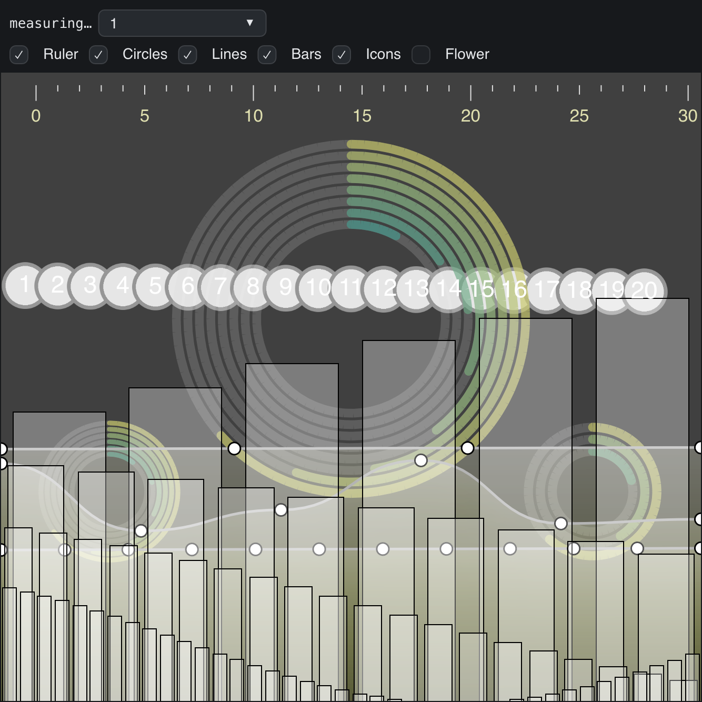

# qcpainterbench

> **Framework:** performance, canvas **Description:** A port of Qt's
> qcpainterbench. It draws six 2D canvas workloads N times per frame and reports
> frames per second.



<!-- explorer: tags=performance,canvas category=performance run=go -->

---

## Where this comes from

This is a behavioral port of Qt's qcpainterbench
([`tests/manual/qcpainterbench`](https://github.com/qt/qtcanvaspainter/tree/dev/tests/manual/qcpainterbench)
in qt/qtcanvaspainter). Qt licenses that code as
`LicenseRef-Qt-Commercial OR GPL-3.0-only`, and go-gui is not GPL.

**No Qt code is copied.** The port copies only behavior:

1. The behavior of each workload was written down in
   `docs/specs/qcpainterbench.md`: the constants, the geometry formulas, the
   colors and the order of drawing.
2. This example was written from that spec, with go-gui's own canvas calls. It
   is new Go code, not a translation of Qt's C++ or QML.

No Qt assets are copied either:

- The icon image is generated in code (`icon.go`). Qt's `circle.png` is not
  used.
- Text uses the go-gui theme font. Qt's bundled Roboto is not used.

## Run

```sh
go run ./examples/qcpainterbench/
```

Click the canvas to pause or resume the animation. Use the selector to set the
render count, and the toggles to turn tests on and off.

For a scripted run that prints CSV and exits:

```sh
go run ./examples/qcpainterbench/ -sweep 1,2,4,8,16,32,64,128,256,512 \
    -seconds 5 -warmup 2
```

Flags:

- `-tests` is the test mask: 1 ruler, 2 circles, 4 lines, 8 bars, 16 icons, 32
  flower. The default is 31, as in Qt (the flower is off).
- `-count` is the render count for an interactive run. Render counts are capped
  at 4096.
- `-sweep`, `-seconds` and `-warmup` set up a scripted run.
- `-novsync` presents without vsync (`WindowCfg.VSyncOff`), as Qt runs this
  benchmark. FPS is then not capped at the display refresh rate. Honored on
  Windows and X11; macOS stays at the display refresh rate.
- `-screenshot` writes a PNG through the software renderer and exits.

## What it demonstrates

- `DrawCanvas` with `AlwaysRedraw` for a canvas that changes every frame.
- An uncapped frame loop: the view calls `w.InvalidateLayout()` each frame.
- Lines, circles, arcs, rects, text, images and gradient-filled triangle meshes.
- Building filled shapes from flattened curves with `FillTrianglesGradient`.

## How to read the numbers

By default go-gui presents with vsync, so FPS stops at the display refresh rate.
With `-novsync`, FPS is raw throughput and compares directly with Qt's number.
With vsync on, look at two things:

- **Saturation count**: the largest render count that still holds the refresh
  rate.
- **`render_us` per pass**: go-gui's CPU time to build the frame, divided by the
  render count. This is the cost of tessellation and command building.

Run each sweep 3 times and use the median. A single run is noisy.

## Not 1:1 with Qt

The workloads use the same formulas as Qt, but some Qt operations have no go-gui
equivalent yet. The example emulates them (search `Emulated:` in
`workloads.go`):

- Round caps on the gauge arcs are half discs.
- Filled curve paths are triangle meshes built in the example.
- Curve strokes use miter joins, not round joins.
- Text uses the theme font, not Roboto. The icon is generated, not Qt's
  `circle.png`.

`docs/specs/qcpainterbench.md` has the full workload description and the list of
renderer gaps.
