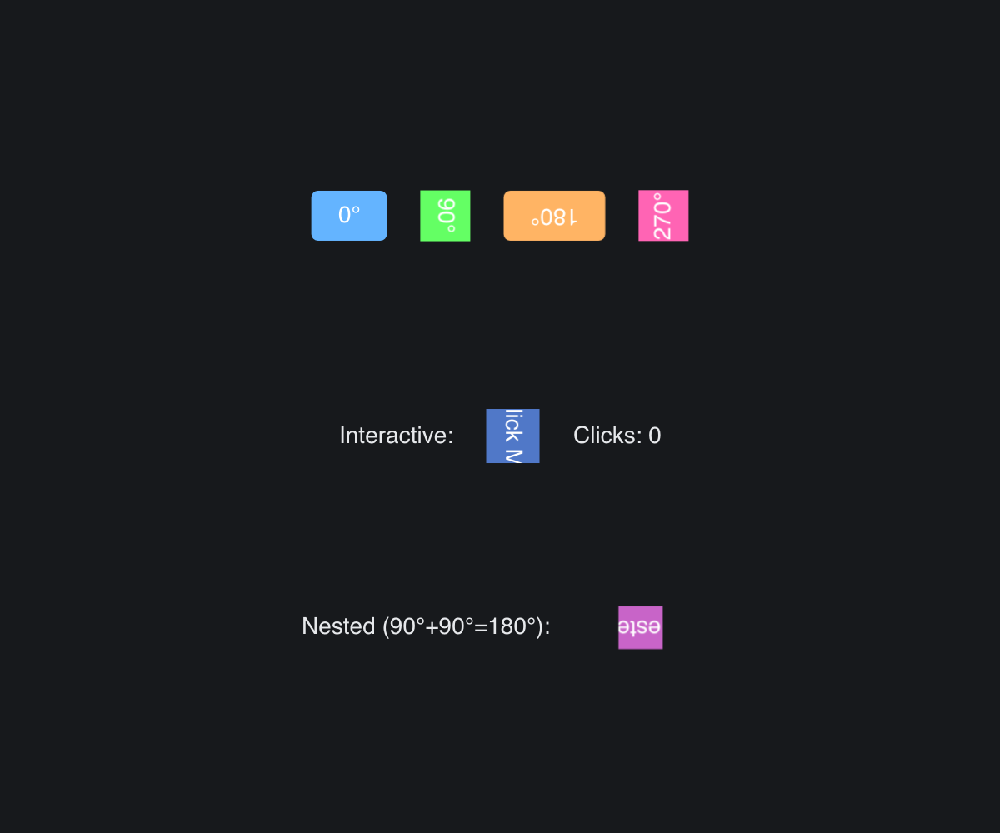

# Rotated Box

> **Framework:** layout **Description:** Quarter-turn rotations with interactive
> content and nesting. Demonstrates RotatedBox composition.



<!-- explorer: tags=layout category=layout run=go -->

---

## Run

```sh
go run ./examples/rotated_box/
```

## What it demonstrates

Quarter-turn rotations with interactive content and nesting. Demonstrates
RotatedBox composition.

See `main.go` for the implementation.
